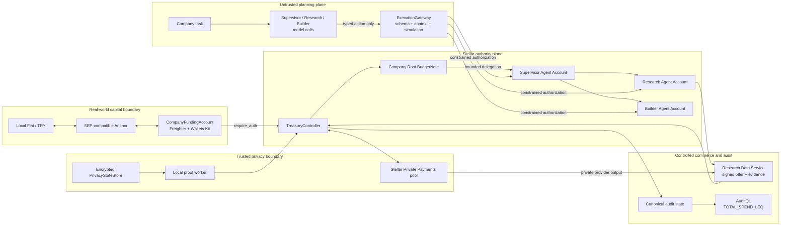
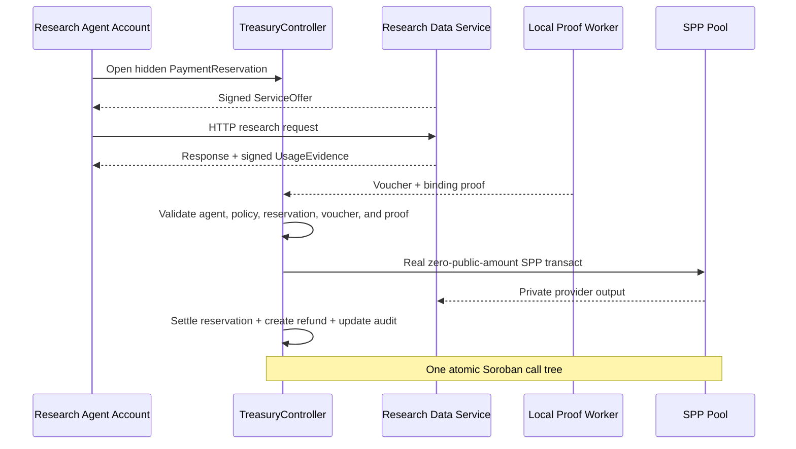

# Phloem

> **Capital flows. Authority stays bounded.**

**A private financial authority protocol for multi-agent organizations on Stellar.**

Phloem lets an organization fund one treasury, delegate cryptographically bounded spending authority through a hierarchy of autonomous agents, settle real provider payments without handing treasury custody to an AI model, and prove selected financial facts without publishing its private spending history.

The current release is a working Stellar Testnet MVP built for the **Stellar Pro Hackathon 2026, Genesis Track**. Its primary path uses Freighter through Stellar Wallets Kit, Soroban smart accounts, Circle Testnet USDC, Stellar Private Payments, Groth16 proofs, a controlled HTTP provider, and a deterministic execution gateway. A live model proposes typed actions; contracts and proof-checked state decide whether those actions are valid.

**One treasury. Branching authority. Private settlement.**

| Project fact | Current value |
|---|---|
| Track | Stellar Pro Hackathon 2026, Genesis Track |
| Network | Stellar Testnet |
| Primary asset | Circle Testnet USDC |
| Company wallet | Freighter through Stellar Wallets Kit |
| Primary settlement mode | PRIVATE, backed by Stellar Private Payments |
| Controlled provider | Research Data Service |
| Live agent model used in the recorded E2E | Google Gemini Live, `gemini-3.8-live` |
| Canonical controller | [`CDGSEV...RVJ2T2`](https://stellar.expert/explorer/testnet/contract/CDGSEV2HZZM4YLVQXXS3EWVZILOFGWHNNVEEZM3S4P7FESA6JIRVJ2T2) |
| Source | Current repository checkout; public URL pending |
| Testnet evidence | [`evidence/testnet/p0-live-e2e-closure.json`](evidence/testnet/p0-live-e2e-closure.json) |
| Deployment manifest | [`deployments/testnet.json`](deployments/testnet.json) |

## Contents

- [Why Phloem?](#why-phloem)
- [The problem](#the-problem)
- [The solution](#the-solution)
- [Flagship value flow](#flagship-value-flow)
- [MVP status](#mvp-status)
- [Architecture](#architecture)
- [The protocol](#the-protocol)
- [Why Stellar](#why-stellar)
- [Security model](#security-model)
- [Privacy model](#privacy-model)
- [Testnet deployments](#testnet-deployments)
- [Evidence and reproducibility](#evidence-and-reproducibility)
- [Run locally](#run-locally)
- [Known limitations and open submission work](#known-limitations-and-open-submission-work)
- [Roadmap](#roadmap)
- [Türkçe özet](#türkçe-özet)

## Why “Phloem”?

Phloem is the living tissue that distributes sugars and other resources from a plant's source through a branching network. The name fits the protocol: capital begins at a company-controlled root, flows through narrower agent branches, and reaches the services that need payment. The root retains control over how much authority enters each branch.

## The problem

Companies want autonomous agents to buy data, inference, compute, storage, and other digital services. Company capital still sits in bank accounts and treasury systems, while those agents operate through APIs and software tools. Connecting the two creates four linked risks:

- **Custody:** giving an agent a treasury key turns a bounded task into broad financial control.
- **Authorization:** an off-chain prompt or database limit does not prevent a compromised agent from exceeding its mandate.
- **Privacy:** public provider and amount data can expose procurement strategy, vendor relationships, research priorities, and operating costs to competitors.
- **Audit:** hiding spend is unacceptable if the company cannot later prove that its agents followed financial policy.

Manual approval for every purchase removes much of the value of autonomous execution. A shared hot wallet gives the agents too much power. A centralized middleware budget can fail open, be bypassed, or become the financial source of truth.

Phloem treats financial authority as a first-class protocol object. An organization delegates a constrained capability, not a custody key.

## The solution

Phloem separates five responsibilities that are often collapsed into one wallet:

| Responsibility | Phloem component |
|---|---|
| Company authorization | Company G-address and `require_auth` |
| Agent identity | One scoped Soroban Agent Account per agent |
| Economic authority | Single-use BudgetNotes arranged in a Budget Graph |
| Private money custody | SPP notes controlled inside the PrivacyRuntime |
| Planning | A model that may emit only validated typed actions |

The company creates a session and controls its Root BudgetNote. It grants the Supervisor a bounded portion of that authority. The Supervisor may split its allocation into narrower Research and Builder branches, subject to immutable provider, category, action, depth, and expiry rules. Each agent account can authorize only the allowed call to the configured TreasuryController.

For a PRIVATE payment, Phloem reserves a hidden amount for one approved service, creates a reservation-specific payment key, binds the provider's signed commercial evidence to a cumulative voucher, and settles through SPP. Provider payment, reservation consumption, refund creation, and the canonical audit update share one Soroban call tree. A failed nested step rolls back the financial transition.

## Who Phloem serves

Phloem is designed for organizations that run agents against shared capital:

- treasury and procurement teams that need hard limits without approving every request;
- companies whose provider choices and unit economics carry competitive value;
- agent-platform teams that need a financial authorization layer outside the model;
- security and compliance teams that need replayable evidence and selective audit;
- auditors who need proof of a policy statement without access to the entire private ledger.

The long-term product model is:

> **Bring your own agents. Phloem gives them bounded financial authority.**

Phloem is not an AI framework. The hosted Supervisor, Research, and Builder agents demonstrate the protocol. The intended product surface is an SDK and API that existing agent systems can call. MCP can become one adapter over that interface.

## Flagship value flow

```text
Local Fiat / TRY
→ SEP-compatible Stellar Anchor
→ Circle Testnet USDC
→ Freighter CompanyFundingAccount
→ PRIVATE SPP-backed Phloem session
→ company-controlled Root BudgetNote
→ bounded Supervisor authority
→ narrower Research and Builder Agent Accounts
→ approved paid service
→ signed ServiceOffer and UsageEvidence
→ reservation-specific PrivateVoucher
→ atomic private SPP settlement, refund, and audit update
→ provider SPP exit to a public settlement account
→ SEP-compatible Anchor withdrawal
→ Local Fiat / TRY
```

The Anchor supplies real-world capital ingress and egress. Phloem begins where liquid Stellar assets enter the treasury boundary and converts those assets into bounded, private, auditable agent authority.

The current official TR Mock Anchor did not reach a terminal SEP-6 state during the final run. Phloem records that condition as an external blocker and does not fabricate an Anchor completion. The Testnet USDC funding, private settlement, provider SPP exit, and session closure remain real and independently verifiable.

## MVP status

Phloem uses explicit labels so a local test, a Testnet transaction, and a roadmap item cannot be confused.

| Capability | Status | Evidence |
|---|---|---|
| Freighter company-wallet boundary through Stellar Wallets Kit | **IMPLEMENTED & TESTED** | Wallet checks and the live funding consoles |
| Company-authorized PRIVATE session creation | **IMPLEMENTED & TESTED** | [`dd3631...d7795`](https://stellar.expert/explorer/testnet/tx/dd363134a19b87ac122abb1c9d5cdbd29c52b30ab3932305384a1af2f4bd7795) |
| Atomic 1 USDC SPP-backed session activation | **IMPLEMENTED & TESTED** | [`282225...687d`](https://stellar.expert/explorer/testnet/tx/28222513a8a73246fbf54cb35d752c827bcb5939ad6680b985ae90cff3d6687d) |
| Root to Supervisor private delegation | **IMPLEMENTED & TESTED** | [`053381...e927`](https://stellar.expert/explorer/testnet/tx/053381f3fbcc6379d50903143c1d90bfb321e56cabcb7b83d156c9a08056e927) |
| Real model calls producing typed Supervisor, Research, and Builder actions | **IMPLEMENTED & TESTED** | Live E2E evidence records `gemini-3.8-live` and both delegation transactions |
| Independent Agent Accounts with bounded controller authority | **IMPLEMENTED & TESTED** | Three deployed C-addresses in the [closure evidence](evidence/testnet/p0-live-e2e-closure.json) |
| Controlled provider HTTP response, signed ServiceOffer, and signed UsageEvidence | **IMPLEMENTED & TESTED** | Reservation, request, response, and evidence hashes in the closure evidence |
| PRIVATE reservation and reservation-specific PaymentCommitmentKey | **IMPLEMENTED & TESTED** | [`9f1f5b...6c7`](https://stellar.expert/explorer/testnet/tx/9f1f5b300fbf106da4042ee9c41a6dcd7bacc90f4d49a77ddd10bd2636f7b6c7) |
| Atomic real SPP settlement, refund, and audit accumulator update | **IMPLEMENTED & TESTED** | [`4cbf34...699c`](https://stellar.expert/explorer/testnet/tx/4cbf34ba492b98d682a272c65209c3ab1e2993ecd450e089f2a02be916a7699c) |
| Provider SPP exit to public Testnet USDC | **IMPLEMENTED & TESTED** | [`65fe70...dd3`](https://stellar.expert/explorer/testnet/tx/65fe702bcc972818a0dae6d99f28fe8735ff90439cb8d26bc842da314ae94dd3), reconciled Horizon balance delta |
| Cross-branch unauthorized action rejection | **IMPLEMENTED & TESTED** | `CROSS_BRANCH_BUDGET_READ`, no transaction or asset movement |
| Drain, immutable audit snapshot, and session close | **IMPLEMENTED & TESTED** | [`3f9659...ca1`](https://stellar.expert/explorer/testnet/tx/3f96591b568e312c57c02ce95dd0a5cc4438819968fadb45454f9d7981ca5ca1), [`1a7ac6...b0b1`](https://stellar.expert/explorer/testnet/tx/1a7ac6bb754155f207405fd66f83ee6f10271539dd4b9dbee1663c9a6131b0b1), [`dcdaad...a0f`](https://stellar.expert/explorer/testnet/tx/dcdaadcea2506f9ffc2190d14bed859a09c7b2d18105c7f32e5305802c25aa0f) |
| `TOTAL_SPEND_LEQ` proof bound to the final live statement | **IMPLEMENTED & TESTED LOCALLY** | Local Groth16 verification passes; proof SHA-256 is recorded in the closure evidence |
| `TOTAL_SPEND_LEQ` acceptance by the deployed Testnet verifier | **OPEN TESTNET DEFECT** | The deployed verifier returned `false`; no false success is shown |
| Official Mock Anchor deposit/withdraw terminal completion | **EXTERNAL BLOCKER** | SEP-6 polling remained non-terminal; no Anchor status was fabricated |
| STANDARD direct SAC settlement | **IMPLEMENTED & TESTED** | Contract and integration test baseline; PRIVATE remains the product demo |
| MPP settlement adapter | **ROADMAP** | Deferred after the tested C-address funder authorization incompatibility |
| Production SPP and Groth16 readiness | **PRODUCTION RELEASE GATE** | Upstream audit, setup provenance, key custody, and contract/circuit audit required |

The core PRIVATE session in the evidence package ended with lifecycle `Closed`, one finalized settlement, zero unresolved reservations, and a reconciled immutable audit snapshot.

## What the live MVP proves

The completed Testnet session starts with 1 USDC of real backing. A live Supervisor model proposes 0.6 USDC of Research authority and 0.1 USDC of Builder authority. The deterministic gateway checks every field against the session context before any transaction is built. The company-approved calls establish both branches on-chain.

The Research branch then:

1. obtains a signed fixed-price offer from the controlled Research Data Service;
2. opens a PRIVATE reservation under its own branch authority;
3. sends a real HTTP request and receives a deterministic response;
4. obtains signed UsageEvidence for that response;
5. issues one cumulative voucher under the reservation-specific PaymentCommitmentKey;
6. settles 0.01 USDC through the deployed SPP pool with public and external amounts set to zero;
7. creates the private refund and updates the canonical audit accumulator in the same settlement;
8. lets the provider exit its received SPP output to its Testnet settlement account;
9. drains, finalizes, and closes the session.

The Builder branch attempts to read Research branch budget state. The gateway checks live Testnet ownership and rejects the cross-branch request before transaction construction. Contract tests separately cover wrong signer, wrong contract, expired authorization, malformed proofs, replay, double settlement, overmint, and nested rollback cases.

## Architecture



### Source-of-truth boundaries

| State | Authoritative source | Non-authoritative helpers |
|---|---|---|
| Session lifecycle, policy, reservations, BudgetNotes, audit state | TreasuryController | UI, logs, model output, indexer cache |
| Agent call authority | Agent Account rule plus TreasuryController state | Gateway preview, frontend role label |
| PRIVATE asset state | SPP contract plus the note owner's secret openings | Upstream read-only SQLite sync cache |
| Phloem private openings and keys | Encrypted PrivacyStateStore | Browser state, relayer, indexer |
| Provider terms and usage | Signed ServiceOffer and UsageEvidence, bound at settlement | Provider database alone |
| Fiat transaction status | The discovered Anchor endpoint | Phloem's degraded continuity record |

Anchor completion cannot mint Phloem budget authority. A model response cannot authorize a payment. The relayer may pay fees and submit a transaction, but it cannot create financial authority. The indexer can improve the interface, but it cannot approve a state transition.

## The protocol

### Sessions and immutable policy

A Session binds one company, asset, settlement mode, provider-policy root, category schema, allowed actions, maximum delegation depth, and expiry. V1 freezes those rules when the session becomes active. A policy change creates a new session so historical audit meaning cannot change after the fact.

PRIVATE and STANDARD are separate backing modes. One session cannot switch between them.

### Budget Graph

The Budget Graph represents authority rather than asset custody.

- A **BudgetNode** identifies a stable company or agent branch.
- A **BudgetNote** is a single-use commitment to a hidden amount and its branch context.
- A valid transition consumes one input note and creates at most two outputs whose hidden amounts conserve value.
- A child branch can receive less authority, a narrower action mask, a narrower category mask, a shorter expiry, and less remaining delegation depth.
- Unallocated Root value never becomes Supervisor authority.

The graph topology and category identifiers are public in V1. PRIVATE amounts remain hidden behind commitments and Groth16 relations.

### Agent Accounts

Each agent has an independent Soroban smart account. Its rule grants one expiring `CallContract(TreasuryController)` capability to one external agent key. The company is not installed as a default signer on agent accounts, and an agent never receives the company key or TreasuryPrivacyKey.

This separation makes branch isolation enforceable. Compromising the Builder key does not grant Research authority, Root authority, or SPP treasury custody.

### Hard policy and soft preference

Phloem keeps hard financial policy outside the model:

| Hard policy, enforced by contracts or proofs | Soft preference, selected by an agent |
|---|---|
| Approved provider and service | Preferred provider |
| Asset and settlement mode | Latency preference |
| Category and action mask | Model or service quality preference |
| Note or reservation bound | Price preference within an allowed bound |
| Expiry and delegation depth | Geographic preference |

A compromised model may make a poor soft-policy choice. It cannot widen a BudgetNote, substitute another provider, change the settlement asset, or sign arbitrary XDR.

### ServiceOffer, UsageEvidence, and PrivateVoucher

Provider approval answers whether a service may be used. A ServiceOffer records the current commercial terms. UsageEvidence records the provider's signed claim about a request and response. Neither object can move funds by itself.

A PRIVATE reservation creates a fresh PaymentCommitmentKey. Only that key may sign the reservation's cumulative voucher. The voucher binds the protocol version, network, controller, session, reservation, offer, usage root, claim, sequence, and deadline. Reusing a treasury or agent key for this purpose would increase the loss radius, so Phloem keeps the capability reservation-specific.

### PRIVATE settlement



`PrivateSettlementBindingV1` ties one hidden claim to all of the following:

- the reservation opening and reservation-specific voucher key;
- the approved provider/service policy leaf;
- the signed usage root;
- the exact SPP provider output and treasury remainder;
- the refund BudgetNote;
- the next canonical audit commitment.

Changing the provider output, claim, voucher key, remainder, or audit update invalidates the proof. A pool failure rolls back controller state.

### STANDARD settlement

STANDARD is the transparent fallback and correctness baseline. The controller consumes a public BudgetNote, performs a direct atomic SAC transfer, creates the remainder, and updates the public running total in one call tree.

STANDARD does not require a Groth16 audit-accumulator proof. The amount is public, so the controller checks `new_total = old_total + settled_amount` itself. This keeps the fallback small and avoids paying for privacy it does not provide.

### AuditQL

AuditQL proves fixed statements over canonical private accounting state. It is not arbitrary SQL and does not let a model invent circuits or verifier keys.

P0 defines one query template:

```text
TOTAL_SPEND_LEQ(X)
```

The final settlement updates the hidden total before the session snapshot is finalized. The proof then establishes that the committed final total is at most `X` without revealing the exact total.

The live closure proof is bound to the deployed controller, session, final snapshot, audit version, threshold, and verification-key identity. Local Groth16 verification succeeds. The current deployed Testnet verifier returns `false` for that same statement, so the application presents degraded evidence and does not claim on-chain AuditQL acceptance.

## Why Stellar

Phloem uses Stellar as an execution and integration environment, not as a settlement badge.

| Stellar capability | Role in Phloem |
|---|---|
| Soroban authorization | Company `require_auth`, scoped smart-account authorization, and nested contract authorization |
| Soroban atomicity | SPP mutation, provider settlement, refund, and audit accounting roll back together |
| Stellar Asset Contract | Contract-native access to Circle Testnet USDC and the STANDARD direct-transfer path |
| Stellar Wallets Kit and Freighter | Human-controlled company funding and review boundary |
| Stellar Anchor standards | TRY/USDC discovery, authentication, customer data, quotes, deposit, and withdrawal |
| OpenZeppelin Stellar Smart Accounts | Independent scoped identities for Supervisor, Research, and Builder |
| Stellar Private Payments | Shielded notes, nullifiers, private transfers, provider output, and public exit |
| Soroban BN254 host support | On-chain verification of Circom/Groth16 relations |
| Stellar RPC simulation | Build, simulate, inspect, authorize, submit, and confirm workflow |

### Anchor standards used

- [SEP-1](https://github.com/stellar/stellar-protocol/blob/master/ecosystem/sep-0001.md) for capability discovery;
- [SEP-10](https://github.com/stellar/stellar-protocol/blob/master/ecosystem/sep-0010.md) for wallet authentication;
- [SEP-12](https://github.com/stellar/stellar-protocol/blob/master/ecosystem/sep-0012.md) when customer information is requested;
- [SEP-38](https://github.com/stellar/stellar-protocol/blob/master/ecosystem/sep-0038.md) for TRY/USDC quotes;
- [SEP-6](https://github.com/stellar/stellar-protocol/blob/master/ecosystem/sep-0006.md) for programmatic deposit and withdrawal.

Phloem re-runs discovery before an off-ramp and uses only the capability the Anchor advertises. It does not simulate SEP-24, invent a withdrawal method, or treat the sandbox banking leg as production Turkish bank settlement.

### Native first, custom where needed

Phloem reuses Stellar auth, SAC, smart accounts, SPP, Anchor standards, Wallets Kit, RPC simulation, and Groth16 verification. Its own protocol work covers the gap between those primitives:

- ZK-conserved hierarchical BudgetNotes;
- immutable company procurement policy;
- reservation-specific payment authority;
- exact reservation-to-SPP output binding;
- signed provider commerce evidence;
- atomic private accounting and refund semantics;
- fixed-predicate selective audit over canonical state.

Phloem does not claim to have invented smart accounts, privacy pools, Anchor standards, or zero-knowledge proofs. Its contribution is the composition and enforcement model that turns those primitives into bounded financial authority for agent organizations.

## Security model

### Core invariants

1. **Authority cannot exceed backing.** Delegation and reservation transitions conserve value.
2. **Custody keys never enter the model context.** Agents receive scoped call authority, not treasury or SPP note secrets.
3. **Consumed authority cannot remain spendable.** Notes, reservations, nullifiers, voucher sequence, and settlement status prevent replay.
4. **Provider payment cannot skip accounting.** PRIVATE settlement and the audit update share one call tree.
5. **The backend is not a bank.** Gateway, relayer, model runtime, provider server, and indexer cannot mint or widen authority.
6. **Privacy does not replace correctness.** The controller checks public rules and verifies hidden relations before state mutation.

### Key and capability separation

| Capability | Holder | Scope |
|---|---|---|
| Company wallet key | Freighter user | Session creation, funding, company-authorized lifecycle calls |
| AgentAuthKey | Encrypted local agent identity vault | One agent account and its scoped controller calls |
| TreasuryPrivacyKey | Encrypted PrivacyStateStore | SPP treasury-note ownership |
| PaymentCommitmentKey | Reservation-specific private state | One reservation's vouchers |
| Provider signing key | Controlled provider server | ServiceOffer and UsageEvidence signatures |
| Provider SPP keys | Controlled provider privacy boundary | Provider output ownership and withdrawal |
| Audit witness | Local proof worker boundary | Proof generation only, no spending authority |
| Relayer fee key | Transaction submitter | Fee payment and submission, no financial authority |

The local P0 runner stores authoritative Phloem private state in an encrypted file-backed PrivacyStateStore. It never writes TreasuryPrivacyKey, PaymentCommitmentKey, voucher private material, or private witness data to the upstream plaintext SQLite sync cache. A stateless Vercel filesystem must not become authoritative private storage.

### Threat assumptions

Phloem treats agents, providers, relayers, indexers, frontend code, and model output as untrusted for financial correctness. A remote prover would also become trusted for witness confidentiality, so P0 proves inside the local privacy boundary.

The company wallet and encrypted privacy runtime remain sensitive. Loss or compromise can affect liveness or private asset custody. Production requires HSM/KMS-grade key management, durable encrypted backups, operational monitoring, governance controls, and independent audits.

## Privacy model

PRIVATE mode hides the internal payment amount and the direct provider-to-amount relationship from the public settlement transaction. The live SPP settlement records `public_amount = 0` and `ext_amount = 0`. Provider identity, claim amount, refund amount, and audit opening remain inside commitments and encrypted local state.

Privacy has limits:

- funding deposits and public withdrawals are visible at their boundary;
- transaction timing and contract participation remain observable;
- SPP commitments and nullifiers are public;
- Budget Graph topology and category identifiers are public in V1;
- repeated or adaptive audit thresholds can leak information;
- a provider sees its own request, response, and payment evidence;
- local network and service metadata can support correlation.

Phloem therefore claims competitive procurement privacy for the internal agent-payment path. It does not claim full anonymity or untraceable payments.

## Anchor outage continuity

The live SEP flow remains canonical. The application also implements an explicitly named degraded path for organizer Anchor outages. This path records the official transaction identifier, last observed status, observation time, and upstream error. It does not forge a SEP-6 response, create USDC, activate a session, or mutate protocol state.

Any continued Phloem demonstration must use independently funded Testnet USDC. A future degraded off-ramp demonstration may record a simulated TRY receipt only after a provider-authorized real Testnet USDC transfer to a separately identified demo-rail sink. That record remains Phloem evidence, not Anchor attestation.

## Testnet deployments

Network passphrase: `Test SDF Network ; September 2015`

### Phloem contracts

| Contract | Testnet ID | WASM SHA-256 |
|---|---|---|
| TreasuryController V2 | [`CDGSEV...RVJ2T2`](https://stellar.expert/explorer/testnet/contract/CDGSEV2HZZM4YLVQXXS3EWVZILOFGWHNNVEEZM3S4P7FESA6JIRVJ2T2) | `a77bf56561530bf8fbc9894dcd80869b9e257d2fb296b61e10b7225b1bf32a70` |
| Ed25519 verifier | [`CC3HSA...J25NRR`](https://stellar.expert/explorer/testnet/contract/CC3HSAEYBR5EHKVFQ2QUYZ3HWFIDDPNEQ2JT5EB2ZXWS3M34ITJ25NRR) | `aa15e1a91fd5d41a755b5321f97bb4290e0db4595dd4408e2e89f16d4d066600` |
| BudgetTransitionV1 verifier | [`CD3GQV...FTJQ4O`](https://stellar.expert/explorer/testnet/contract/CD3GQVHD4R3E4WMFEFB6H5IJJUZXYE3IFFNY65P2J3L2V6R6A6FTJQ4O) | `0e068ff97a66fb5056c7249444e2b31762dc1ae9031a725d7f5ae8f1676ddb0d` |
| PrivateRootBackingV1 verifier | [`CBR7ZU...3A5PA`](https://stellar.expert/explorer/testnet/contract/CBR7ZUMSLGWHUJBL7YKL2HRTYAWB34CPM5MG5OFYANENMOTCBHH3A5PA) | `779d500e9afcf7d07eac315ae41ecc4e23df581dfceec2fd5a7668d45a270005` |
| PrivateSettlementBindingV1 verifier | [`CA5MLD...NXVRRW`](https://stellar.expert/explorer/testnet/contract/CA5MLD4MNE2S3TQ3C47PARFSWL3XPXTQS5HQHS7ZDGTKXB7TMVNXVRRW) | `058079beb6e94dec7bfc594c3a2f21554af82d4bdd62a8fa70689d8ba0c72029` |
| AuditTotalSpendLeqV1 verifier | [`CAM5OB...P57DE`](https://stellar.expert/explorer/testnet/contract/CAM5OBYNHYPTZKLUE2NGI7ORPBLBU456KFFXYWZZ5V6EUJWMVXZP57DE) | `415805bd7213128dc84cd21225888786781444655492462fb1544c2366d460e4` |

Audit verifier VK SHA-256: `2cceaad298a9c90e9f569ed677808f827471f8872c0727988bab9c7720efab19`

Agent Account WASM SHA-256: `0a9d54d3bf278131cf2239e1db52eee54f057d4e3241a6aafc2b28bca22d156d`

| Live session identity | Testnet contract | Deployment transaction |
|---|---|---|
| Supervisor | [`CBHC4O...3Y7FF`](https://stellar.expert/explorer/testnet/contract/CBHC4OV6WX2E4XAXCPBT552YEYV2BXHKVPTCM3FQFARSIADE7HI3Y7FF) | [`0bd716...f25c7`](https://stellar.expert/explorer/testnet/tx/0bd716d6603088ba52090fbc88a20d3e5b2888d20502825ec1f29c54483f25c7) |
| Research | [`CAZVV2...KTEUE`](https://stellar.expert/explorer/testnet/contract/CAZVV2VAQYZOMWZLHQR5H7NZSTYZYTWZSHLGQ2ZW4BKDXYBZBPQKTEUE) | [`f3a49f...2f8ae`](https://stellar.expert/explorer/testnet/tx/f3a49fa84c3086d4187653e5c88c495593c7791b7339606a496a89398ae2f8ae) |
| Builder | [`CCL2CC...YUXUHC`](https://stellar.expert/explorer/testnet/contract/CCL2CCGDQKM3PSJCGXYCAR6MD6M3HCIW35UFOVDH34XVH4SSVNYUXUHC) | [`6802cc...0e3d7`](https://stellar.expert/explorer/testnet/tx/6802cc19003bc1329e1f308ec09b13683a30261943ecd1146557e713bc50e3d7) |

### Stellar Private Payments deployment

Pinned upstream revision: [`NethermindEth/stellar-private-payments@5f3a5d4`](https://github.com/NethermindEth/stellar-private-payments/tree/5f3a5d41f452069caf8d0e1654675bca55cb94d3)

| Component | Testnet ID |
|---|---|
| SPP pool | [`CC57FD...AOSLB4`](https://stellar.expert/explorer/testnet/contract/CC57FDSWPIHALXW2XWVSKEA7FA72Z37Y7AP5ASRY6V3CXAZCWQAOSLB4) |
| Public-key registry | [`CB3OX6...GFELKT`](https://stellar.expert/explorer/testnet/contract/CB3OX6UGZCKQZFN3WQHCIBBAMIWIDHLZWC4JS6VYJE4U5WWQN5GFELKT) |
| ASP membership | [`CB6APJ...MZ2Z55`](https://stellar.expert/explorer/testnet/contract/CB6APJ4NHOTHETD4IZERG3CIQMC6YDSSWWCRNN7NG5YZNO5RTMMZ2Z55) |
| ASP non-membership | [`CC43C3...QUEWHI`](https://stellar.expert/explorer/testnet/contract/CC43C3FITFAECE7FA4YJHMZS2ANHM5O2ZVTXI2F2K5W5V4R35JQUEWHI) |
| SPP verifier | [`CCLUTV...GGS33A`](https://stellar.expert/explorer/testnet/contract/CCLUTVXT4XTE52CMG5W2YUYRR32KVSO5GNOMIL4ZLNFZYDXVPPGGS33A) |

Circle Testnet USDC:

```text
Asset code: USDC
Issuer: GBBD47IF6LWK7P7MDEVSCWR7DPUWV3NY3DTQEVFL4NAT4AQH3ZLLFLA5
SAC: CBIELTK6YBZJU5UP2WWQEUCYKLPU6AUNZ2BQ4WWFEIE3USCIHMXQDAMA
Decimals: 7
```

The machine-readable manifest records source revisions, upload and instance transaction hashes, constructor verification, WASM hashes, fees, instruction counts, and write bytes. It is the deployment source of truth.

## Evidence and reproducibility

### Representative live transactions

| Operation | Transaction |
|---|---|
| Session creation | [`dd363134...bd7795`](https://stellar.expert/explorer/testnet/tx/dd363134a19b87ac122abb1c9d5cdbd29c52b30ab3932305384a1af2f4bd7795) |
| PRIVATE activation | [`28222513...d6687d`](https://stellar.expert/explorer/testnet/tx/28222513a8a73246fbf54cb35d752c827bcb5939ad6680b985ae90cff3d6687d) |
| Root delegation | [`053381f3...56e927`](https://stellar.expert/explorer/testnet/tx/053381f3fbcc6379d50903143c1d90bfb321e56cabcb7b83d156c9a08056e927) |
| Research delegation | [`94cd4560...7c153`](https://stellar.expert/explorer/testnet/tx/94cd4560ea04b4a14db2f222b899264f5bb2456a36718e537d669c1215a7c153) |
| Builder delegation | [`d8789ce4...8e5c0`](https://stellar.expert/explorer/testnet/tx/d8789ce448e132e70ac83da15fc27801cfd8072f2aa991514b5f1f43fcb8e5c0) |
| PRIVATE reservation | [`9f1f5b30...f7b6c7`](https://stellar.expert/explorer/testnet/tx/9f1f5b300fbf106da4042ee9c41a6dcd7bacc90f4d49a77ddd10bd2636f7b6c7) |
| SPP rebalance | [`ef8e94f3...a67cf5b`](https://stellar.expert/explorer/testnet/tx/ef8e94f3ca92439f84b73292409f9f6438ac4039d0643a4949230ff26a67cf5b) |
| PRIVATE settlement | [`4cbf34ba...a7699c`](https://stellar.expert/explorer/testnet/tx/4cbf34ba492b98d682a272c65209c3ab1e2993ecd450e089f2a02be916a7699c) |
| Provider SPP exit | [`65fe702b...ae94dd3`](https://stellar.expert/explorer/testnet/tx/65fe702bcc972818a0dae6d99f28fe8735ff90439cb8d26bc842da314ae94dd3) |
| Begin draining | [`3f96591b...1ca5ca1`](https://stellar.expert/explorer/testnet/tx/3f96591b568e312c57c02ce95dd0a5cc4438819968fadb45454f9d7981ca5ca1) |
| Finalize audit snapshot | [`1a7ac6bb...6131b0b1`](https://stellar.expert/explorer/testnet/tx/1a7ac6bb754155f207405fd66f83ee6f10271539dd4b9dbee1663c9a6131b0b1) |
| Close session | [`dcdaadce...c25aa0f`](https://stellar.expert/explorer/testnet/tx/dcdaadcea2506f9ffc2190d14bed859a09c7b2d18105c7f32e5305802c25aa0f) |

### Evidence files

| File | Purpose |
|---|---|
| [`evidence/testnet/p0-live-e2e-closure.json`](evidence/testnet/p0-live-e2e-closure.json) | Canonical live session, agent, provider, settlement, exit, negative-case, and closure evidence |
| [`deployments/testnet.json`](deployments/testnet.json) | Canonical Testnet IDs, source pins, hashes, transactions, and resource measurements |
| [`deployments/spp-usdc-testnet.sdk.json`](deployments/spp-usdc-testnet.sdk.json) | SDK-oriented SPP deployment data |
| [`protocol/test-vectors/v1.json`](protocol/test-vectors/v1.json) | Cross-language canonical encoding vectors |
| [`docs/evidence/private-reservation-runtime-local.json`](docs/evidence/private-reservation-runtime-local.json) | Local BudgetTransition proving and encrypted-state checks |
| [`docs/evidence/private-root-backing-local.json`](docs/evidence/private-root-backing-local.json) | Private root-backing circuit and rollback evidence |
| [`docs/evidence/private-spp-local.json`](docs/evidence/private-spp-local.json) | Pinned upstream SPP proof and pool compatibility evidence |

### Circuit evidence

| Circuit | Purpose | Public evidence |
|---|---|---|
| `EncodingVectorV1` | Rust, TypeScript, and Circom encoding parity | `protocol/test-vectors/v1.json` |
| `BudgetTransitionV1` | Hidden amount conservation and branch transition | Local full-prove/verify evidence and deployed verifier |
| `PrivateRootBackingV1` | Public SPP deposit to hidden Root and zero-spend audit state | 3,476 constraints, 7 public inputs |
| `PrivateSettlementBindingV1` | Reservation, provider output, refund, and audit binding | 18,487 constraints, 16 public inputs |
| `AuditAccumulatorV1` | Hidden canonical total initialization and update semantics | Real INIT and UPDATE fixtures |
| `AuditTotalSpendLeqV1` | Fixed threshold proof over the final snapshot | 4,750 constraints; local live-statement verification passes |

All committed proving fixtures use a disclosed single-contributor development setup. They are fit for Testnet validation, not production ceremony claims.

## Repository map

| Path | Responsibility |
|---|---|
| `apps/web` | Next.js review console, Wallets Kit/Freighter boundary, Anchor routes, provider routes, and live operation consoles |
| `contracts/treasury-controller` | Canonical sessions, BudgetNotes, reservations, settlement, audit state, and lifecycle |
| `contracts/agent-account` | Scoped Soroban authorization for each agent identity |
| `contracts/*-verifier` | Immutable-key Ed25519 and Groth16 verifier contracts |
| `circuits` | Circom V1 encodings, conservation, backing, binding, accumulator, and AuditQL relations |
| `packages/agent-runtime` | Model-provider adapters and role-specific typed action generation |
| `packages/execution-gateway` | Validation, chain-state checks, invocation assembly, simulation, authorization, and submission ports |
| `packages/privacy-runtime` | Encrypted private state, keys, proof planning, vouchers, SPP adapters, and provider exit |
| `packages/protocol-types` | Canonical schemas, encodings, and cross-language vectors |
| `packages/treasury-controller-client` | Generated TreasuryController TypeScript client |
| `crates/protocol-encoding` | Rust canonical protocol encoding |
| `scripts` | Bootstrap, vector, proof, contract, preflight, and deployment workflows |
| `deployments` | Public machine-readable Testnet deployment manifests |
| `evidence` | Public Testnet execution evidence |

The private master specification and local protocol working documents are intentionally excluded from Git. Public claims in this README are backed by committed code, manifests, tests, and evidence files.

## Run locally

### Prerequisites

- Node.js `24.19.0`
- pnpm `11.22.0`
- Rust `1.95.0`
- Stellar CLI `28.0.0`
- Circom `2.2.3`
- Brave or another Chromium browser with Freighter for live wallet flows

Exact versions and upstream revisions live in [`config/dependencies.lock.json`](config/dependencies.lock.json).

### Install

```bash
corepack enable
pnpm install
scripts/bootstrap/install-circom.sh
```

### Configure the web application

```bash
cp .env.example apps/web/.env.local
```

The checked-in example contains public Testnet contract and network values. Live operation routes also require server-only values for the encrypted PrivacyStateStore, model provider, controlled provider, and provider SPP custody. Keep those values in `apps/web/.env.local`. Never prefix them with `NEXT_PUBLIC_`, paste them into prompts, or commit them.

The complete live flow requires:

- a Freighter account on Testnet with fee XLM and a Circle Testnet USDC trustline;
- the matching `COMPANY_FUNDING_PUBLIC_KEY`;
- a 32-byte AES key for `PHLOEM_PRIVATE_STATE_KEY_HEX`;
- `GOOGLE_API_KEY` for the demonstrated Gemini Live provider, or `NVIDIA_API_KEY` for the alternative NIM adapter;
- separate controlled-provider signing, SPP note, encryption, membership, and settlement-account values described in `.env.example`.

No API key grants financial authority. Model output still passes through the typed gateway and on-chain authorization rules.

### Verify the protocol and build

```bash
pnpm phase0:check
pnpm test
pnpm typecheck
pnpm contracts:test
pnpm contracts:bindings:check
pnpm build
```

`phase0:check` validates schemas, canonical encodings, Rust/TypeScript/Circom vectors, mutation rejection, and the frozen protocol boundary. `phase1:check` adds read-only Testnet RPC and Anchor discovery checks and therefore depends on external services:

```bash
pnpm phase1:check
```

### Start the review console

```bash
pnpm --filter @phloem/web dev
```

Open `http://localhost:3000`. The operation consoles are available at:

```text
/                                  wallet, Anchor discovery, and funding
/ops/private-session               create the company-authorized PRIVATE session
/ops/private-agents                deploy and verify the three Agent Accounts
/ops/private-activation            fund the SPP-backed Root BudgetNote
/ops/private-root-delegation       grant bounded Supervisor authority
/ops/live-agents                   run live model actions, provider request, settlement, and SPP exit
/ops/provider-offramp              discover and run the provider Anchor off-ramp
/ops/session-finalization          drain, finalize AuditQL evidence, and close
```

Every financial console separates preparation and simulation from wallet review and submission. The UI does not report success before RPC confirmation.

### Safe reviewer path

Reviewers who do not want to sign or move Testnet assets can run the test suite, inspect the deployment manifest and closure evidence, and open every Stellar Expert transaction above. Running the full live sequence creates new Testnet state and requires the matching private local state; it should not be attempted with copied evidence IDs or unknown keys.

## Testing strategy

The repository tests financial invariants at several boundaries:

| Layer | Representative checks |
|---|---|
| Encoding | Rust, TypeScript, Circom, BN254 field, byte order, domain separation |
| Circuits | Positive witnesses plus amount, provider, output, key, audit, context, and range mutations |
| Contracts | Auth, conservation, replay, double spend, double settlement, expiry, lifecycle, and rollback |
| Agent Accounts | Exact controller rule, one agent key, no default rule, wrong contract and expiry rejection |
| PrivacyRuntime | Encrypted persistence, key separation, temp witness cleanup, proof generation, state reconciliation |
| ExecutionGateway | Typed schemas, context substitution rejection, live chain ownership, simulation, and submission |
| Provider | Offer/evidence signatures, stale requests, malformed requests, and fixed pricing |
| Anchor | Discovery, session confinement, status handling, degraded evidence, and unsupported-capability rejection |
| Testnet E2E | Funding, delegation, reservation, real provider call, settlement, exit, finalization, and closure |

Critical negative cases fail before asset movement or roll back the complete call tree. Tests do not replace the live evidence package; the evidence package does not replace mutation and rollback tests.

## Design decisions and trade-offs

### One controlled provider for P0

The MVP uses one Research Data Service instead of a marketplace. This removes third-party API uptime and billing-key risk while preserving the full commercial path: HTTP request, signed offer, signed usage, voucher, private settlement, and provider-owned output. A second provider would add breadth without proving a stronger authority invariant.

### PRIVATE first, STANDARD retained

PRIVATE is the flagship because procurement privacy is part of the product. STANDARD remains a smaller direct-SAC fallback, a transparent debugging baseline, and a way to distinguish financial correctness from privacy machinery.

### SPP for money, Budget Graph for authority

SPP notes carry private asset ownership. BudgetNotes carry organizational spending authority. Combining them into one object would force a privacy-pool note to understand company hierarchy and would make treasury policy dependent on upstream wallet state. Phloem binds the two at activation and settlement while keeping each primitive responsible for one job.

### Local proving and encrypted state for the MVP

A remote prover can be untrusted for proof correctness but still learns every witness it receives. P0 therefore keeps proof generation and authoritative private openings inside one encrypted local boundary. Production needs durable encrypted backing and stronger key custody rather than a stateless server filesystem.

### MPP deferred from P0

The tested MPP revision did not compose cleanly with the required C-address funder authorization path. Phloem kept STANDARD settlement as a direct SAC transfer instead of weakening smart-account boundaries or adding a custom imitation. V1 can add an official MPP adapter after that composition path is validated.

### Fixed audit predicates

AuditQL uses registered templates and immutable verifier identities. A model may translate a natural-language request into a whitelisted query, but it cannot generate financial SQL, choose a circuit, or change the statement. P0 implements only `TOTAL_SPEND_LEQ`.

## Known limitations and open submission work

This repository is a Testnet prototype. It has not received an independent security audit and must not be used with production funds.

- **SPP maturity:** the pinned Stellar Private Payments implementation describes itself as WIP and unaudited.
- **Trusted setup:** committed Groth16 fixtures use a development setup, not a production multi-party ceremony.
- **Audit verifier:** the final live AuditQL proof verifies locally but the deployed Testnet verifier currently returns `false`.
- **Anchor availability:** the event TR Mock Anchor remained non-terminal during the final SEP-6 poll. The app records the outage and never presents it as completed local-rail evidence.
- **Private-state durability:** P0 uses an encrypted local file. A stateless or ephemeral hosting filesystem cannot preserve authoritative note and witness state.
- **Recovery:** safe recovery semantics are designed, but full recovery infrastructure and UX are outside the MVP.
- **Privacy:** deposits, exits, timing, topology, category IDs, commitments, and nullifiers remain observable.
- **Asset scope:** V1 supports one asset per session. Multi-asset and FX-normalized audit are roadmap work.
- **Policy updates:** active-session policy is immutable. Changed policy requires a new session.
- **Scalability:** shared audit and pool state remain contention points. No public TPS claim is made.
- **Hosted demo:** this repository does not yet record a public frontend URL. The current review console runs locally because private proving state is persistent and server-side.
- **Traction evidence:** no 3-5 person non-team usability study is committed yet. That remains a submission task and must not be fabricated.
- **Demo package:** a fallback video and structured external feedback record remain submission work.

## Roadmap

### V1 product

- publish a stable SDK/API for existing agent runtimes;
- provide an MCP adapter over the same typed authority interface;
- move encrypted private state to a durable recoverable backing service without making that service financial authority;
- add production-grade policy tooling for session creation and branch narrowing;
- add the official MPP adapter once C-address authorization composition passes;
- add provider onboarding tools while keeping immutable provider/service policy roots;
- complete the on-chain AuditQL verifier fix and portable proof bundle;
- support stable public deployment of the review experience with a separate persistent privacy runner;
- add recovery, incident response, and auditable key rotation;
- complete independent contract, circuit, encoding, and dependency reviews.

### Later extensions

- additional AuditQL templates such as category spend thresholds;
- child-specific provider subsets and a larger policy language;
- multi-asset sessions and FX-normalized reporting;
- multi-Anchor routing and additional local rails;
- AP2 and other commerce-evidence adapters;
- broader wallet coverage and SEP-45/SEP-59 support where useful;
- long-lived private treasury allocation across sessions;
- measured branch-concurrency and pool-sharding work.

Phloem will not become a general agent framework or a provider marketplace. Its durable product boundary is financial authority, settlement binding, and selective audit.

## Continuity beyond the hackathon

The next credible milestone is a public V1 developer preview followed by an SCF or InstaAwards application. That milestone requires the AuditQL Testnet fix, a durable privacy runner, a production setup plan, an external security review, and recorded user validation with teams that operate paid agents.

The MVP already establishes the hard part of that direction: real Stellar liquidity can fund a company-controlled root, a hierarchy of agents can receive independent bounded authority, one agent can buy a real service through private settlement, and the provider can recover public USDC without giving an AI treasury custody.

## Stellar resources used

The implementation used pinned project-local Stellar skills and verified upstream sources. Exact pins are recorded in [`config/dependencies.lock.json`](config/dependencies.lock.json).

| Skill | Use |
|---|---|
| `.agents/skills/anchor-tr/SKILL.md` | TR Mock Anchor discovery, SEP-10, SEP-12, SEP-38, SEP-6, and outage behavior |
| `.agents/skills/smart-contracts/SKILL.md` | Soroban contract auth, storage, cross-contract calls, testing, and deployment |
| `.agents/skills/dapp/SKILL.md` | Stellar SDK, Wallets Kit, Freighter, simulation, signing, and submission |
| `.agents/skills/assets/SKILL.md` | Circle USDC trustline and SAC integration |
| `.agents/skills/data/SKILL.md` | RPC, Horizon, transaction, ledger, and balance verification |
| `.agents/skills/zk-proofs/SKILL.md` | Circom, Groth16, BN254, and Soroban verifier integration |
| `.agents/skills/standards/SKILL.md` | SEP selection and ecosystem references |

Primary upstream references:

- [Stellar developer documentation](https://developers.stellar.org/)
- [Stellar protocol and SEP repository](https://github.com/stellar/stellar-protocol)
- [OpenZeppelin Stellar Contracts](https://github.com/OpenZeppelin/stellar-contracts)
- [Stellar Wallets Kit](https://github.com/Creit-Tech/Stellar-Wallets-Kit)
- [Stellar Private Payments](https://github.com/NethermindEth/stellar-private-payments)

## Türkçe özet

<details>
<summary>Türkçe proje özeti</summary>

Phloem, şirketlerin treasury custody'sini yapay zeka agentlarına devretmeden onlara sınırlandırılmış ekonomik yetki vermesini sağlayan Stellar tabanlı bir finansal yetki protokolüdür.

Şirket, Freighter cüzdanı üzerinden bir PRIVATE session oluşturur ve Root BudgetNote üzerinde kontrolü korur. Supervisor'a yalnızca belirlenmiş bir miktar, süre ve işlem kapsamı devreder. Supervisor da Research ve Builder için birbirinden bağımsız, daha dar yetkili Agent Account'lar kullanır. Model yalnızca typed action önerir; ExecutionGateway, Agent Account ve TreasuryController bu önerinin session, branch, provider, category, tutar ve süre kurallarına uyup uymadığını denetler.

Research Agent, kontrollü Research Data Service'ten imzalı ServiceOffer alır, gerçek HTTP isteği yapar ve imzalı UsageEvidence üretir. PRIVATE reservation'a özel PaymentCommitmentKey ile voucher hazırlanır. Gerçek SPP settlement, provider çıktısı, refund BudgetNote ve gizli audit accumulator güncellemesi tek Soroban işlem ağacında gerçekleşir. Agent hiçbir aşamada şirket cüzdan anahtarını veya TreasuryPrivacyKey'i almaz.

Tamamlanan Testnet akışında 1 USDC ile session aktive edilmiş, Supervisor üzerinden Research ve Builder branch'leri oluşturulmuş, 0.01 USDC değerindeki provider ödemesi private settlement ile tamamlanmış, provider SPP çıktısını public Testnet USDC hesabına çıkarmış ve session audit snapshot sonrasında `Closed` durumuna getirilmiştir. Builder'ın Research branch verisine erişme denemesi transaction oluşturulmadan reddedilmiştir.

İki açık durum dürüstçe belgelenmiştir. Resmî TR Mock Anchor SEP-6 işlemi terminal duruma ulaşmadığı için Anchor tamamlanmış gibi gösterilmemiştir. Final `TOTAL_SPEND_LEQ` proof'u canlı statement üzerinde yerelde doğrulanmıştır, ancak deploy edilen Testnet verifier `false` döndürdüğü için on-chain AuditQL başarısı iddia edilmemektedir.

V1 hedefi mevcut agent sistemlerine SDK/API ile bağlanmak, MCP adaptörü sunmak, kalıcı şifreli private-state altyapısı kurmak, policy araçlarını geliştirmek, uygun C-address authorization desteği doğrulandığında MPP adaptörünü eklemek ve production release gate'lerini kapatmaktır. Phloem bir AI framework veya provider marketplace olmayı hedeflemez; ürün sınırı bounded financial authority, private settlement binding ve selective audit'tir.

</details>

## Team

Phloem is built by **Eren Kol** as a solo Genesis Track project.

## License and upstream notice

Phloem's original repository code is available under the [MIT License](LICENSE).

Pinned upstream projects retain their own licenses and notices. Stellar Private Payments is an external dependency with separate licensing and distribution obligations for some generated artifacts. Anyone distributing a build that includes those artifacts must review and comply with the upstream license and notice files.

---

**Phloem:** private financial authority for organizations whose agents need to act, pay, and remain accountable.
