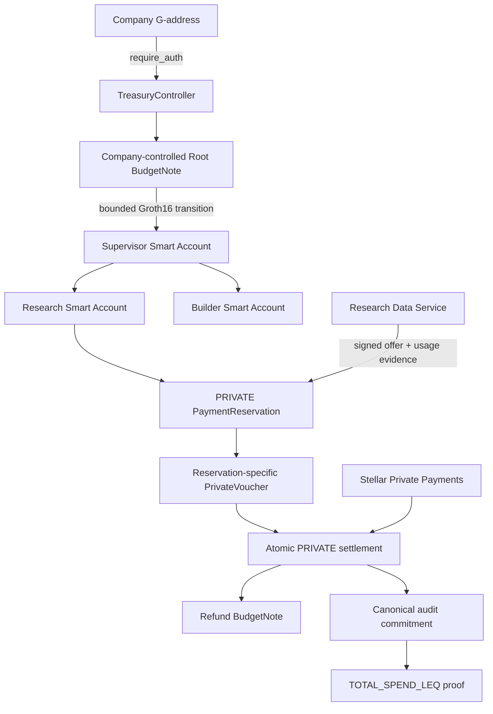

# Phloem

Phloem gives autonomous agents bounded economic authority without giving them treasury custody. A company creates a session, retains Root authority, delegates a limited private budget to scoped Stellar Smart Accounts, pays a deterministic service through real Stellar Testnet settlement, and later proves a fixed audit predicate without revealing the exact spend.

Phloem is being built by one developer for the Stellar Pro Hackathon 2026, Genesis Track.

## P0 demo

The flagship path is:

```text
Freighter + Wallets Kit
→ TRY/USDC Mock Anchor onboarding
→ company-authorized PRIVATE session
→ bounded Root-to-Supervisor delegation
→ independent Research and Builder agent branches
→ signed Research Data Service offer and usage evidence
→ reservation-specific private voucher
→ real SPP Testnet settlement + refund + audit update
→ provider SPP exit + SEP-6 USDC/TRY withdrawal
→ TOTAL_SPEND_LEQ(X) proof
```

STANDARD direct SAC payment remains a tested fallback. MPP, UltraHonk privacy, production recovery, production trusted setup, marketplaces, and additional providers are outside P0.

## Authority and settlement architecture



The company is never a signer on an Agent Smart Account. Agent keys can invoke only the scoped `TreasuryController` contract. The PRIVATE treasury capability remains inside the dedicated PrivacyRuntime.

The P0 provider is a single Phloem-controlled Research Data Service. It must complete a real HTTP request, sign its ServiceOffer and UsageEvidence, receive real Testnet settlement, exit the private-money domain to its provider account, and use only the withdrawal capability currently advertised by the Mock Anchor.

## Repository status

- Phase 0 protocol encoding, schemas, interfaces, and cross-language vectors: implemented.
- Rust/TypeScript/Circom plus Soroban host Poseidon2 parity and mutation rejection: passing, including the frozen session audit context and initial/rolling audit commitments.
- Read-only Testnet RPC and Mock Anchor SEP discovery: passing.
- Wallets Kit/Freighter funding surface, exact Circle USDC trustline checks, validated SEP-10 challenge path, server-confined Anchor session, and SEP-38/SEP-6 deposit UI: implemented; the first live TRY → USDC Testnet completion has passed.
- Server-only NVIDIA NIM provider abstraction and strictly typed agent action runtime: implemented; live inference awaits the user-supplied key.
- Deterministic ExecutionGateway routing, generated TreasuryController binding, real RPC simulation adapter, contract-origin rejection evidence, and exact Agent Smart Account authorization-set checks: implemented. The PRIVATE witness/action assembler and live submission adapters remain pending.
- The controlled Research Data Service exposes real health, offer, and research HTTP routes. It signs canonically encoded ServiceOffer and UsageEvidence payloads with a server-only Ed25519 key, returns deterministic local research results, and rejects stale or malformed requests. Live provider signing awaits the user-supplied provider key and deployed controller address; voucher creation and Testnet settlement remain pending.
- Canonical PRIVATE voucher bytes now match the frozen TypeScript/Rust vector on-chain. TreasuryController validates protocol/network/controller/session/reservation/offer/deadline scope and verifies the Ed25519 signature under the reservation-specific PaymentCommitmentKey; field or signature mutation fails closed. Runtime voucher issuance and atomic settlement consumption remain pending.
- TreasuryController authority backbone: session creation, company-controlled Root materialization, bounded STANDARD Root → Supervisor → child delegation, PRIVATE reservation opening, and the atomic PRIVATE settlement call tree are implemented. PRIVATE activation now composes the company-authorized SAC deposit into SPP with Root BudgetNote creation, hidden zero-spend audit initialization, and a session-scoped TreasuryPrivacyKey commitment in one call tree. PRIVATE settlement verifies the scoped voucher and 16-signal binding proof, requires the pinned SPP transfer shape (`public_amount=0`, `ext_amount=0`), invokes the configured pool, creates the hidden refund note, and updates reservation/audit state atomically without storing amount or provider plaintext. Native tests use an ABI-compatible pool double and prove cross-contract rollback. The pinned SPP stack also passes real local Groth16 deposit, zero-public-amount transfer, and tampered-output rejection tests against its actual pool; Phloem controller composition on Testnet is still required before this is labeled end-to-end complete.
- BudgetTransitionV1 now enforces 64-bit ranges, exact conservation, output type/shape rules, and context-bound commitments in Circom. A dedicated immutable-key Soroban verifier accepts the checked-in real Groth16 proof and rejects replay under a mutated context, malformed inputs, and non-canonical BN254 field values. TreasuryController reconstructs canonical BudgetNote and reservation contexts from stored identities and invokes the configured verifier for PRIVATE reservation creation. The fixture uses a disclosed development-only single-contributor setup; deployment-grade setup evidence and Testnet execution remain pending.
- AuditAccumulatorV1 and its immutable-key verifier retain real INIT/UPDATE Groth16 fixtures as a reusable accumulator semantics primitive. STANDARD does not pay that ZK cost: activation derives a public zero-total commitment, while settlement deterministically checks and updates the public running total and zero-blinded canonical commitment. Agent authorization, the single-provider policy leaf, category/action scope, SAC transfer, remainder note, PaymentRecord, and audit update still share one atomic call tree. PRIVATE will enforce the hidden claim and freshly blinded audit update inside its mandatory binding proof.
- PrivateSettlementBindingV1 now has an executable 18,487-constraint BN254 circuit, real Groth16 proof fixture, and immutable-key Soroban verifier. One hidden claim is bound simultaneously to the reservation opening, reservation-specific voucher key and usage root, the approved controlled-provider leaf, pinned-SPP provider output, treasury-owned SPP change output, optional refund BudgetNote, and freshly blinded canonical audit update. Partial and exact-claim witnesses pass; overclaim, provider, SPP output, treasury remainder, voucher-key, and audit mutations fail. TreasuryController now composes this verifier with the pinned SPP `transact` ABI in one rollback-safe call tree. The pinned pool accepts its canonical real transfer proof; controller-composed Testnet execution and resource evidence remain pending.
- PrivateRootBackingV1 has a 3,476-constraint BN254 circuit, real Groth16 proof fixture, and immutable-key Soroban verifier. It binds one public SPP deposit amount to the hidden Root BudgetNote, zero-spend audit commitment, TreasuryPrivacyKey commitment, and exact SPP funding output. Overmint, root, audit, key, and SPP-output mutations fail; duplicate backing and nested SPP failure leave no partial controller or pool state.
- The scoped Agent Smart Account and Ed25519 verifier compile from the pinned OpenZeppelin revision. Native tests enforce one expiring `CallContract(TreasuryController)` rule, one external agent key, no policies, no Default rule, and rejection of wrong-contract or expired authorization. Live SDK wiring remains gated because the current upstream Smart Account Kit targets SDK 16.3 / Protocol 27 while this app uses SDK 17.1 on Protocol 28.
- PRIVATE witness assembly, wallet-authorized Testnet composition, provider settlement/exit, Anchor withdrawal, and final deployments: in progress.

This repository does not yet claim a complete hackathon demo or production readiness.

## Development

Prerequisites are pinned in `config/dependencies.lock.json`. Install JavaScript dependencies and the pinned Circom compiler:

```bash
pnpm install
scripts/bootstrap/install-circom.sh
```

Run the protocol freeze checks:

```bash
pnpm phase0:check
```

Repeat the read-only live compatibility checks:

```bash
pnpm phase1:check
```

Run the Phase 1 browser surface:

```bash
pnpm --filter @phloem/web dev
```

The deep master specification and internal architecture notes are intentionally private and ignored by Git. The committed, machine-verifiable protocol surface lives in the TypeScript and Rust encoding packages, the Circom vector circuit, and [`protocol/test-vectors/v1.json`](protocol/test-vectors/v1.json).

## Project-local Stellar references

The implementation uses project-local, pinned skills rather than copying example application code:

- `anchor-tr` from `yigitcangokmen/stellar-hackathon-turkiye` at `f06e1ae682111271d1d35476305cba04a0522139` for the event Mock Anchor and its SEP flows.
- `smart-contracts`, `dapp`, `assets`, `data`, `zk-proofs`, and `standards` from `stellar/stellar-dev-skill` at `202be802aab27a5fe3076726a7a236378f690af1`.

The Anchor reference contains raw-key examples; Phloem overrides those examples and keeps company signing in Wallets Kit/Freighter.

## Current security boundaries

- No production secret, wallet seed, witness, SPP note opening, or encrypted private-state file belongs in Git.
- Feasibility transactions establish architecture viability but are not presented as final implementation benchmarks.
- SPP remains WIP/unaudited. Production Groth16 setup provenance remains a release gate.
- The final audit-extended settlement circuit must be remeasured on Testnet. Atomic settlement/audit semantics will not be weakened to fit a resource limit.

## License

MIT
