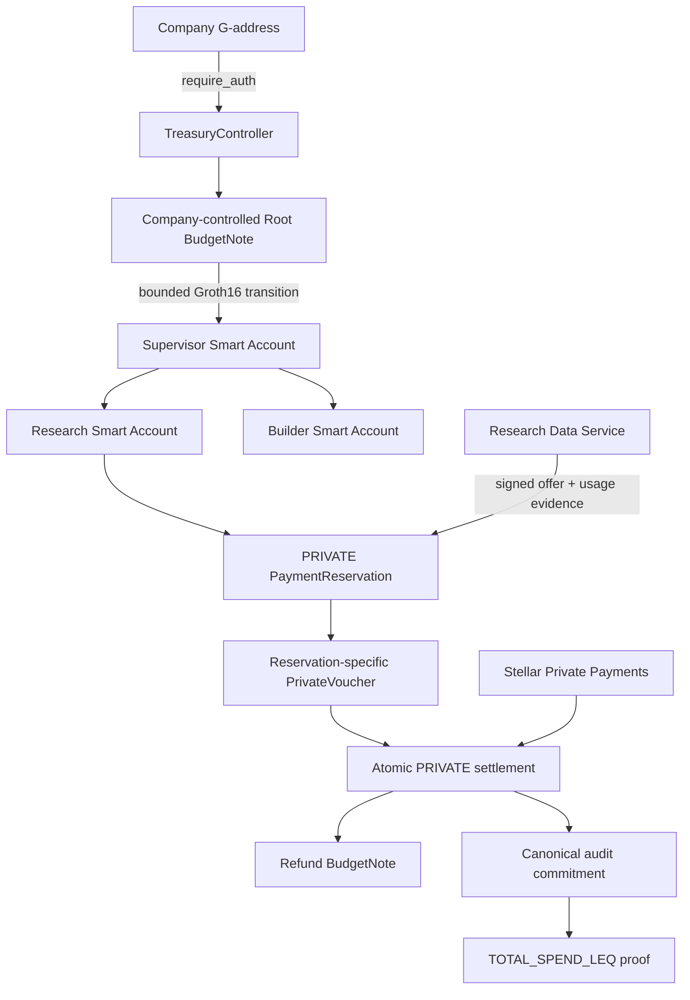

# Phloem

Phloem gives autonomous agents bounded economic authority without giving them treasury custody. A company creates a session, retains Root authority, delegates a limited private budget to scoped Stellar Smart Accounts, pays a deterministic service through real Stellar Testnet settlement, and later proves a fixed audit predicate without revealing the exact spend.

Phloem is being built by one developer for the Stellar Pro Hackathon 2026, Genesis Track.

## P0 demo

The flagship path is:

```text
Freighter + Wallets Kit
→ TRY/USDC Mock Anchor onboarding
→ company-authorized PRIVATE session
→ bounded Root-to-Supervisor delegation
→ independent Research and Builder agent branches
→ signed Research Data Service offer and usage evidence
→ reservation-specific private voucher
→ real SPP Testnet settlement + refund + audit update
→ provider SPP exit + SEP-6 USDC/TRY withdrawal
→ TOTAL_SPEND_LEQ(X) proof
```

STANDARD direct SAC payment remains a tested fallback. MPP, UltraHonk privacy, production recovery, production trusted setup, marketplaces, and additional providers are outside P0.

## Authority and settlement architecture



The company is never a signer on an Agent Smart Account. Agent keys can invoke only the scoped `TreasuryController` contract. The PRIVATE treasury capability remains inside the dedicated PrivacyRuntime.

The P0 provider is a single Phloem-controlled Research Data Service. It must complete a real HTTP request, sign its ServiceOffer and UsageEvidence, receive real Testnet settlement, exit the private-money domain to its provider account, and use only the withdrawal capability currently advertised by the Mock Anchor.

## Repository status

- Phase 0 protocol encoding, schemas, interfaces, and cross-language vectors: implemented.
- Rust/TypeScript/Circom plus Soroban host Poseidon2 parity and mutation rejection: passing, including the frozen session audit context and initial/rolling audit commitments.
- Read-only Testnet RPC and Mock Anchor SEP discovery: passing.
- Wallets Kit/Freighter funding surface, exact Circle USDC trustline checks, validated SEP-10 challenge path, server-confined Anchor session, and SEP-38/SEP-6 deposit UI: implemented; the first live TRY → USDC Testnet completion has passed.
- Server-only NVIDIA NIM provider abstraction and strictly typed agent action runtime: implemented; live inference awaits the user-supplied key.
- Deterministic ExecutionGateway ports and contract-origin rejection evidence path: implemented; live contract adapter remains pending.
- TreasuryController authority backbone: session creation, company-controlled Root materialization, real SAC custody funding, bounded STANDARD Root → Supervisor → child delegation, and the protocol-native BN254 Poseidon2 adapter are implemented. Exact company/agent authorization trees, conservation, policy narrowing, expiry/freeze rejection, pinned Agent Account WASM identity, rollback behavior, and host/circuit commitment parity are covered by native contract tests.
- BudgetTransitionV1 now enforces 64-bit ranges, exact conservation, output type/shape rules, and context-bound commitments in Circom. A dedicated immutable-key Soroban verifier accepts the checked-in real Groth16 proof and rejects replay under a mutated context, malformed inputs, and non-canonical BN254 field values. TreasuryController independently reconstructs canonical BudgetNote contexts from stored identities with cross-language vector parity. The fixture uses a disclosed development-only single-contributor setup; wiring proof verification into the PRIVATE transition path and producing deployment-grade setup evidence remain pending.
- AuditAccumulatorV1 proves both a fresh commitment to an initial zero total and exact STANDARD updates without revealing the running total. Its immutable-key Soroban verifier accepts real INIT/UPDATE Groth16 proofs and rejects amount/context replay. STANDARD activation now verifies the INIT proof and atomically creates canonical audit state with SAC funding and Root authority; a failed proof or failed transfer leaves all three unchanged.
- The scoped Agent Smart Account and Ed25519 verifier compile from the pinned OpenZeppelin revision. Native tests enforce one expiring `CallContract(TreasuryController)` rule, one external agent key, no policies, no Default rule, and rejection of wrong-contract or expired authorization. Live SDK wiring remains gated because the current upstream Smart Account Kit targets SDK 16.3 / Protocol 27 while this app uses SDK 17.1 on Protocol 28.
- Contracts, circuits, wallet-authorized Phloem session funding, provider workflow, and final deployments: in progress.

This repository does not yet claim a complete hackathon demo or production readiness.

## Development

Prerequisites are pinned in `config/dependencies.lock.json`. Install JavaScript dependencies and the pinned Circom compiler:

```bash
pnpm install
scripts/bootstrap/install-circom.sh
```

Run the protocol freeze checks:

```bash
pnpm phase0:check
```

Repeat the read-only live compatibility checks:

```bash
pnpm phase1:check
```

Run the Phase 1 browser surface:

```bash
pnpm --filter @phloem/web dev
```

The deep master specification and internal architecture notes are intentionally private and ignored by Git. The committed, machine-verifiable protocol surface lives in the TypeScript and Rust encoding packages, the Circom vector circuit, and [`protocol/test-vectors/v1.json`](protocol/test-vectors/v1.json).

## Project-local Stellar references

The implementation uses project-local, pinned skills rather than copying example application code:

- `anchor-tr` from `yigitcangokmen/stellar-hackathon-turkiye` at `f06e1ae682111271d1d35476305cba04a0522139` for the event Mock Anchor and its SEP flows.
- `smart-contracts`, `dapp`, `assets`, `data`, `zk-proofs`, and `standards` from `stellar/stellar-dev-skill` at `202be802aab27a5fe3076726a7a236378f690af1`.

The Anchor reference contains raw-key examples; Phloem overrides those examples and keeps company signing in Wallets Kit/Freighter.

## Current security boundaries

- No production secret, wallet seed, witness, SPP note opening, or encrypted private-state file belongs in Git.
- Feasibility transactions establish architecture viability but are not presented as final implementation benchmarks.
- SPP remains WIP/unaudited. Production Groth16 setup provenance remains a release gate.
- The final audit-extended settlement circuit must be remeasured on Testnet. Atomic settlement/audit semantics will not be weakened to fit a resource limit.

## License

MIT
