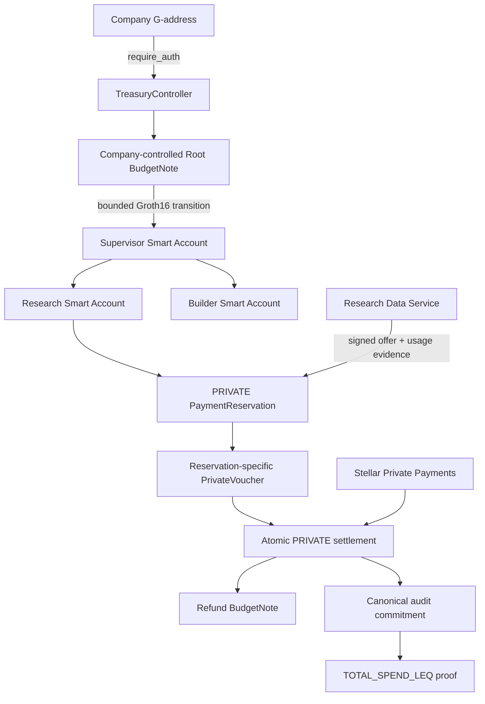

# Phloem

Phloem gives autonomous agents bounded economic authority without giving them treasury custody. A company creates a session, retains Root authority, delegates a limited private budget to scoped Stellar Smart Accounts, pays a deterministic service through real Stellar Testnet settlement, and later proves a fixed audit predicate without revealing the exact spend.

Phloem is being built by one developer for the Stellar Pro Hackathon 2026, Genesis Track.

## P0 demo

The flagship path is:

```text
Freighter + Wallets Kit
→ TRY/USDC Mock Anchor onboarding
→ company-authorized PRIVATE session
→ bounded Root-to-Supervisor delegation
→ independent Research and Builder agent branches
→ signed Research Data Service offer and usage evidence
→ reservation-specific private voucher
→ real SPP Testnet settlement + refund + audit update
→ TOTAL_SPEND_LEQ(X) proof
```

STANDARD direct SAC payment remains a tested fallback. MPP, UltraHonk privacy, production recovery, production trusted setup, marketplaces, and additional providers are outside P0.

## Authority and settlement architecture



The company is never a signer on an Agent Smart Account. Agent keys can invoke only the scoped `TreasuryController` contract. The PRIVATE treasury capability remains inside the dedicated PrivacyRuntime.

## Repository status

- Phase 0 protocol encoding, schemas, interfaces, and cross-language vectors: implemented.
- Rust/TypeScript/Circom Poseidon2 parity and mutation rejection: passing.
- Read-only Testnet RPC and Mock Anchor SEP discovery: passing.
- Minimal Wallets Kit browser surface and live compatibility checks: implemented.
- Wallet-authenticated Anchor flow, contracts, circuits, provider workflow, and final deployments: in progress.

This repository does not yet claim a complete hackathon demo or production readiness.

## Development

Prerequisites are pinned in `config/dependencies.lock.json`. Install JavaScript dependencies and the pinned Circom compiler:

```bash
pnpm install
scripts/bootstrap/install-circom.sh
```

Run the protocol freeze checks:

```bash
pnpm phase0:check
```

Repeat the read-only live compatibility checks:

```bash
pnpm phase1:check
```

Run the Phase 1 browser surface:

```bash
pnpm --filter @phloem/web dev
```

The deep master specification and internal architecture notes are intentionally private and ignored by Git. The committed, machine-verifiable protocol surface lives in the TypeScript and Rust encoding packages, the Circom vector circuit, and [`protocol/test-vectors/v1.json`](protocol/test-vectors/v1.json).

## Current security boundaries

- No production secret, wallet seed, witness, SPP note opening, or encrypted private-state file belongs in Git.
- Feasibility transactions establish architecture viability but are not presented as final implementation benchmarks.
- SPP remains WIP/unaudited. Production Groth16 setup provenance remains a release gate.
- The final audit-extended settlement circuit must be remeasured on Testnet. Atomic settlement/audit semantics will not be weakened to fit a resource limit.

## License

MIT
