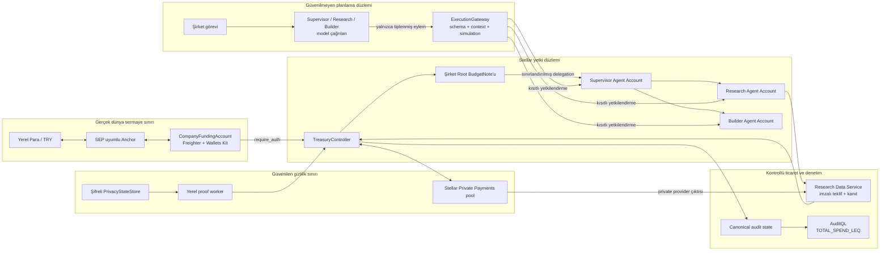
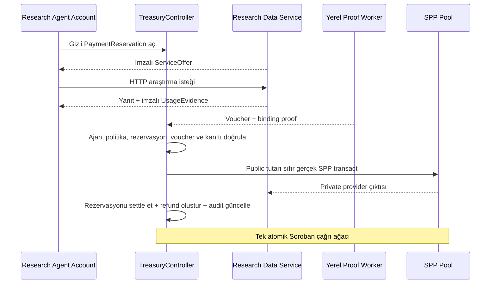

# Phloem

[English](README.md) | [**Türkçe**](README.tr.md)

> **Sermaye akar. Yetki sınırlar içinde kalır.**

**Stellar üzerinde çok ajanlı organizasyonlar için gizlilik odaklı finansal yetki protokolü.**

Phloem; bir kuruluşun tek bir treasury fonlamasına, otonom ajanlardan oluşan bir hiyerarşiye kriptografik olarak sınırlandırılmış harcama yetkisi vermesine, treasury saklama kontrolünü bir yapay zekâ modeline devretmeden gerçek servis ödemelerini kesinleştirmesine ve özel harcama geçmişini yayımlamadan seçili finansal gerçekleri kanıtlamasına imkân verir.

Bu sürüm, **Stellar Pro Hackathon 2026, Genesis Track** için geliştirilmiş ve Stellar Testnet üzerinde çalışan bir MVP'dir. Ana akış; Stellar Wallets Kit üzerinden Freighter, Soroban akıllı hesapları, Circle Testnet USDC, Stellar Private Payments, Groth16 kanıtları, kontrollü bir HTTP servis sağlayıcısı ve deterministik bir execution gateway kullanır. Canlı model yalnızca tiplenmiş eylemler önerir; bu eylemlerin geçerliliğine kontratlar ve kanıtlarla doğrulanan state karar verir.

**Tek treasury. Dallanan yetki. Gizli mutabakat.**

| Proje bilgisi | Güncel değer |
|---|---|
| Kategori | Stellar Pro Hackathon 2026, Genesis Track |
| Ağ | Stellar Testnet |
| Ana varlık | Circle Testnet USDC |
| Şirket cüzdanı | Stellar Wallets Kit üzerinden Freighter |
| Ana mutabakat modu | Stellar Private Payments destekli PRIVATE |
| Kontrollü servis sağlayıcı | Research Data Service |
| Kaydedilmiş E2E akışında kullanılan canlı ajan modeli | Google Gemini Live, `gemini-3.8-live` |
| Canonical controller | [`CDGSEV...RVJ2T2`](https://stellar.expert/explorer/testnet/contract/CDGSEV2HZZM4YLVQXXS3EWVZILOFGWHNNVEEZM3S4P7FESA6JIRVJ2T2) |
| Kaynak | Mevcut repository checkout'u; herkese açık URL bekleniyor |
| Testnet kanıtı | [`evidence/testnet/p0-live-e2e-closure.json`](evidence/testnet/p0-live-e2e-closure.json) |
| Deployment manifesti | [`deployments/testnet.json`](deployments/testnet.json) |

## İçindekiler

- [Neden Phloem?](#neden-phloem)
- [Problem](#problem)
- [Çözüm](#çözüm)
- [Ana değer akışı](#ana-değer-akışı)
- [MVP durumu](#mvp-durumu)
- [Mimari](#mimari)
- [Protokol](#protokol)
- [Neden Stellar?](#neden-stellar)
- [Güvenlik modeli](#güvenlik-modeli)
- [Gizlilik modeli](#gizlilik-modeli)
- [Testnet deployment'ları](#testnet-deploymentları)
- [Kanıtlar ve yeniden üretilebilirlik](#kanıtlar-ve-yeniden-üretilebilirlik)
- [Yerelde çalıştırma](#yerelde-çalıştırma)
- [Bilinen sınırlamalar ve açık teslim işleri](#bilinen-sınırlamalar-ve-açık-teslim-işleri)
- [Yol haritası](#yol-haritası)

## Neden “Phloem”?

Phloem, bitkinin kaynağında üretilen şeker ve diğer kaynakları dallanan bir ağ üzerinden dağıtan canlı dokudur. Protokol de aynı ilkeye dayanır: sermaye şirketin kontrolündeki kökten başlar, daha dar ajan dallarından geçer ve ödemeye ihtiyaç duyan servislere ulaşır. Kök, her dala ne kadar yetki girdiğinin kontrolünü korur.

## Problem

Şirketler otonom ajanların veri, inference, compute, storage ve diğer dijital servisleri satın almasını istiyor. Kurumsal sermaye hâlâ banka hesaplarında ve treasury sistemlerinde dururken ajanlar API'ler ve yazılım araçları üzerinden çalışıyor. Bu iki dünyayı birleştirmek, birbirine bağlı dört risk doğuruyor:

- **Saklama kontrolü:** bir ajana treasury anahtarı vermek, sınırlandırılmış bir görevi geniş finansal kontrole dönüştürür.
- **Yetkilendirme:** zincir dışı bir prompt veya veritabanı limiti, ele geçirilmiş bir ajanın yetki sınırını aşmasını engellemez.
- **Gizlilik:** açık provider ve tutar verileri; satın alma stratejisini, tedarikçi ilişkilerini, araştırma önceliklerini ve operasyon maliyetlerini rakiplere gösterebilir.
- **Denetim:** şirket daha sonra ajanların finansal politikaya uyduğunu kanıtlayamıyorsa harcamayı gizlemek kabul edilebilir değildir.

Her satın alma için manuel onay istemek, otonom yürütmenin değerini büyük ölçüde ortadan kaldırır. Ortak bir hot wallet ajanlara gereğinden fazla güç verir. Merkezi bir middleware bütçesi fail-open davranabilir, atlanabilir veya finansal doğruluğun asıl kaynağı hâline gelebilir.

Phloem finansal yetkiyi birinci sınıf bir protokol nesnesi olarak ele alır. Kuruluş bir saklama anahtarını değil, sınırları belirlenmiş bir capability'yi devreder.

## Çözüm

Phloem, çoğu zaman tek bir cüzdanda birleştirilen beş sorumluluğu ayırır:

| Sorumluluk | Phloem bileşeni |
|---|---|
| Şirket yetkilendirmesi | Şirket G-adresi ve `require_auth` |
| Ajan kimliği | Her ajan için kapsamı belirlenmiş bir Soroban Agent Account |
| Ekonomik yetki | Budget Graph içinde düzenlenen tek kullanımlık BudgetNote'lar |
| Gizli para saklama kontrolü | PrivacyRuntime içinde kontrol edilen SPP note'ları |
| Planlama | Yalnızca doğrulanmış tiplenmiş eylemler üretebilen model |

Şirket bir session oluşturur ve Root BudgetNote'un kontrolünü elinde tutar. Supervisor'a bu yetkinin sınırlandırılmış bir bölümünü verir. Supervisor; değişmez provider, kategori, eylem, derinlik ve süre sonu kurallarına uyarak Research ve Builder için daha dar dallar oluşturabilir. Her ajan hesabı yalnızca yapılandırılmış TreasuryController'a izin verilen çağrıyı yetkilendirebilir.

PRIVATE ödemede Phloem, onaylanmış tek bir servis için gizli tutar rezerve eder, rezervasyona özel bir ödeme anahtarı üretir, servis sağlayıcının imzalı ticari kanıtlarını kümülatif voucher'a bağlar ve SPP üzerinden settlement gerçekleştirir. Provider ödemesi, rezervasyonun tüketilmesi, refund oluşturulması ve canonical audit güncellemesi aynı Soroban çağrı ağacında gerçekleşir. İç içe adımlardan biri başarısız olursa finansal geçiş bütünüyle geri alınır.

## Phloem kimler için?

Phloem, ortak sermaye üzerinde çalışan ajanlara sahip kuruluşlar için tasarlanmıştır:

- her isteği tek tek onaylamadan kesin limitler uygulamak isteyen treasury ve procurement ekipleri;
- provider tercihleri ve birim ekonomileri rekabet değeri taşıyan şirketler;
- modelin dışında bir finansal yetkilendirme katmanına ihtiyaç duyan agent platform ekipleri;
- tekrar oynatılabilir kanıt ve seçici denetim isteyen güvenlik ve uyum ekipleri;
- özel ledger'ın tamamına erişmeden bir politika ifadesinin doğruluğunu görmek isteyen denetçiler.

Uzun vadeli ürün modeli şudur:

> **Kendi ajanlarını getir. Phloem onlara sınırlandırılmış finansal yetki versin.**

Phloem bir yapay zekâ framework'ü değildir. Host edilen Supervisor, Research ve Builder ajanları protokolü gösteren demo uygulamasıdır. Hedef ürün yüzeyi, mevcut ajan sistemlerinin çağırabileceği bir SDK ve API'dir. MCP bu arayüz üzerindeki adaptörlerden biri olabilir.

## Ana değer akışı

```text
Yerel Para / TRY
→ SEP uyumlu Stellar Anchor
→ Circle Testnet USDC
→ Freighter CompanyFundingAccount
→ SPP destekli PRIVATE Phloem session
→ şirket kontrollü Root BudgetNote
→ sınırlandırılmış Supervisor yetkisi
→ daha dar Research ve Builder Agent Account'ları
→ onaylı ücretli servis
→ imzalı ServiceOffer ve UsageEvidence
→ rezervasyona özel PrivateVoucher
→ atomik private SPP settlement, refund ve audit güncellemesi
→ provider SPP çıktısının açık settlement hesabına çıkışı
→ SEP uyumlu Anchor withdrawal
→ Yerel Para / TRY
```

Anchor, gerçek dünyadaki sermayenin sisteme girişini ve sistemden çıkışını sağlar. Phloem, likit Stellar varlıklarının treasury sınırına girdiği yerde başlar ve bu varlıkları sınırlandırılmış, gizli ve denetlenebilir ajan yetkisine dönüştürür.

Resmî TR Mock Anchor, son çalıştırmada terminal bir SEP-6 durumuna ulaşmadı. Phloem bunu dış bağımlılıktan kaynaklanan bir engel olarak kaydeder ve Anchor tamamlanmasını uydurmaz. Testnet USDC fonlaması, private settlement, provider SPP çıkışı ve session kapanışı gerçektir ve birbirinden bağımsız olarak doğrulanabilir.

## MVP durumu

Phloem; yerel test, Testnet işlemi ve yol haritası öğelerinin birbirine karışmaması için açık durum etiketleri kullanır.

| Yetkinlik | Durum | Kanıt |
|---|---|---|
| Stellar Wallets Kit üzerinden Freighter şirket cüzdanı sınırı | **UYGULANDI VE TEST EDİLDİ** | Cüzdan kontrolleri ve canlı fonlama konsolları |
| Şirket tarafından yetkilendirilen PRIVATE session oluşturma | **UYGULANDI VE TEST EDİLDİ** | [`dd3631...d7795`](https://stellar.expert/explorer/testnet/tx/dd363134a19b87ac122abb1c9d5cdbd29c52b30ab3932305384a1af2f4bd7795) |
| Atomik, 1 USDC ile SPP destekli session aktivasyonu | **UYGULANDI VE TEST EDİLDİ** | [`282225...687d`](https://stellar.expert/explorer/testnet/tx/28222513a8a73246fbf54cb35d752c827bcb5939ad6680b985ae90cff3d6687d) |
| Root'tan Supervisor'a private delegation | **UYGULANDI VE TEST EDİLDİ** | [`053381...e927`](https://stellar.expert/explorer/testnet/tx/053381f3fbcc6379d50903143c1d90bfb321e56cabcb7b83d156c9a08056e927) |
| Tiplenmiş Supervisor, Research ve Builder eylemleri üreten gerçek model çağrıları | **UYGULANDI VE TEST EDİLDİ** | Canlı E2E kanıtı `gemini-3.8-live` ile iki delegation işlemini kaydeder |
| Sınırlandırılmış controller yetkisine sahip bağımsız Agent Account'lar | **UYGULANDI VE TEST EDİLDİ** | [Kapanış kanıtındaki](evidence/testnet/p0-live-e2e-closure.json) üç deploy edilmiş C-adresi |
| Kontrollü provider HTTP yanıtı, imzalı ServiceOffer ve imzalı UsageEvidence | **UYGULANDI VE TEST EDİLDİ** | Kapanış kanıtındaki rezervasyon, istek, yanıt ve kanıt hash'leri |
| PRIVATE reservation ve rezervasyona özel PaymentCommitmentKey | **UYGULANDI VE TEST EDİLDİ** | [`9f1f5b...6c7`](https://stellar.expert/explorer/testnet/tx/9f1f5b300fbf106da4042ee9c41a6dcd7bacc90f4d49a77ddd10bd2636f7b6c7) |
| Atomik gerçek SPP settlement, refund ve audit accumulator güncellemesi | **UYGULANDI VE TEST EDİLDİ** | [`4cbf34...699c`](https://stellar.expert/explorer/testnet/tx/4cbf34ba492b98d682a272c65209c3ab1e2993ecd450e089f2a02be916a7699c) |
| Provider SPP çıkışının açık Testnet USDC'ye dönüşmesi | **UYGULANDI VE TEST EDİLDİ** | [`65fe70...dd3`](https://stellar.expert/explorer/testnet/tx/65fe702bcc972818a0dae6d99f28fe8735ff90439cb8d26bc842da314ae94dd3), Horizon bakiye farkıyla mutabık |
| Dallar arası yetkisiz eylemin reddi | **UYGULANDI VE TEST EDİLDİ** | `CROSS_BRANCH_BUDGET_READ`; transaction veya varlık hareketi yok |
| Draining, değişmez audit snapshot ve session kapatma | **UYGULANDI VE TEST EDİLDİ** | [`3f9659...ca1`](https://stellar.expert/explorer/testnet/tx/3f96591b568e312c57c02ce95dd0a5cc4438819968fadb45454f9d7981ca5ca1), [`1a7ac6...b0b1`](https://stellar.expert/explorer/testnet/tx/1a7ac6bb754155f207405fd66f83ee6f10271539dd4b9dbee1663c9a6131b0b1), [`dcdaad...a0f`](https://stellar.expert/explorer/testnet/tx/dcdaadcea2506f9ffc2190d14bed859a09c7b2d18105c7f32e5305802c25aa0f) |
| Final canlı statement'a bağlı `TOTAL_SPEND_LEQ` kanıtı | **YERELDE UYGULANDI VE TEST EDİLDİ** | Yerel Groth16 doğrulaması geçiyor; kanıtın SHA-256 değeri kapanış kanıtında |
| Deploy edilmiş Testnet verifier'ın `TOTAL_SPEND_LEQ` kabulü | **AÇIK TESTNET HATASI** | Deploy edilmiş verifier `false` döndürdü; sahte başarı gösterilmiyor |
| Resmî Mock Anchor deposit/withdraw terminal tamamlanması | **DIŞ BAĞIMLILIK ENGELİ** | SEP-6 polling terminal duruma ulaşmadı; Anchor durumu uydurulmadı |
| STANDARD doğrudan SAC settlement | **UYGULANDI VE TEST EDİLDİ** | Kontrat ve entegrasyon testi temeli; ürün demosu PRIVATE |
| MPP settlement adaptörü | **YOL HARİTASI** | Test edilen C-address fonlayıcı yetkilendirme uyumsuzluğundan sonra ertelendi |
| Production SPP ve Groth16 hazırlığı | **PRODUCTION YAYIN KOŞULU** | Upstream audit, setup provenance, anahtar saklama ve kontrat/circuit audit'i gerekli |

Kanıt paketindeki ana PRIVATE session; `Closed` lifecycle durumu, kesinleşmiş tek settlement, sıfır çözümlenmemiş rezervasyon ve mutabık değişmez audit snapshot ile tamamlandı.

## Canlı MVP neyi kanıtlıyor?

Tamamlanan Testnet session, gerçek 1 USDC backing ile başlar. Canlı Supervisor modeli Research için 0,6 USDC, Builder için 0,1 USDC yetki önerir. Deterministik gateway herhangi bir transaction kurulmadan önce her alanı session bağlamına göre denetler. Şirketin onayladığı çağrılar iki dalı da zincir üzerinde kurar.

Research dalı daha sonra:

1. kontrollü Research Data Service'ten imzalı sabit fiyatlı teklif alır;
2. kendi dal yetkisi altında PRIVATE rezervasyon açar;
3. gerçek bir HTTP isteği gönderip deterministik yanıt alır;
4. yanıt için imzalı UsageEvidence alır;
5. rezervasyona özel PaymentCommitmentKey ile tek bir kümülatif voucher üretir;
6. public ve external tutarlar sıfır olacak şekilde deploy edilmiş SPP pool üzerinden 0,01 USDC settlement gerçekleştirir;
7. private refund'u oluşturur ve aynı settlement içinde canonical audit accumulator'ı günceller;
8. provider'ın aldığı SPP çıktısını kendi Testnet settlement hesabına çıkarmasını sağlar;
9. session'ı draining durumuna geçirir, finalize eder ve kapatır.

Builder dalı, Research dalının bütçe state'ini okumayı dener. Gateway canlı Testnet ownership bilgisini kontrol eder ve transaction kurulmadan önce bu dallar arası isteği reddeder. Kontrat testleri ayrıca yanlış signer, yanlış kontrat, süresi geçmiş yetki, hatalı kanıt, replay, double settlement, overmint ve iç içe rollback senaryolarını kapsar.

## Mimari



### Doğruluk kaynağı sınırları

| State | Yetkili doğruluk kaynağı | Yetkili olmayan yardımcı kaynaklar |
|---|---|---|
| Session lifecycle, politika, rezervasyonlar, BudgetNote'lar, audit state | TreasuryController | UI, loglar, model çıktısı, indexer cache |
| Ajan çağrı yetkisi | Agent Account kuralı ve TreasuryController state'i | Gateway önizlemesi, frontend rol etiketi |
| PRIVATE varlık state'i | SPP kontratı ve note sahibinin secret opening'leri | Upstream salt okunur SQLite sync cache |
| Phloem private opening ve anahtarları | Şifreli PrivacyStateStore | Tarayıcı state'i, relayer, indexer |
| Provider şartları ve kullanım | Settlement sırasında bağlanan imzalı ServiceOffer ve UsageEvidence | Tek başına provider veritabanı |
| Fiat işlem durumu | Discovery ile bulunan Anchor endpoint'i | Phloem degraded continuity kaydı |

Anchor tamamlanması Phloem bütçe yetkisi basamaz. Model yanıtı bir ödemeyi yetkilendiremez. Relayer ücret ödeyip transaction gönderebilir, ancak finansal yetki oluşturamaz. Indexer arayüzü iyileştirebilir, fakat state transition onaylayamaz.

## Protokol

### Session'lar ve değişmez politika

Session; tek bir şirketi, varlığı, settlement modunu, provider-policy root'unu, kategori şemasını, izin verilen eylemleri, azami delegation derinliğini ve expiry bilgisini birbirine bağlar. V1, session aktif olduğunda bu kuralları dondurur. Sonradan yapılan politika değişikliği yeni session oluşturur; böylece geçmiş audit anlamı geriye dönük değişmez.

PRIVATE ve STANDARD ayrı backing modlarıdır. Bir session bu iki mod arasında geçiş yapamaz.

### Budget Graph

Budget Graph, varlık saklama kontrolünü değil yetkiyi temsil eder.

- **BudgetNode**, kararlı bir şirket veya ajan dalını tanımlar.
- **BudgetNote**, gizli bir tutar ve dal bağlamına ait tek kullanımlık commitment'tır.
- Geçerli transition bir input note tüketir ve gizli tutarları değeri koruyan en fazla iki output üretir.
- Alt dal; daha az yetki, daha dar action mask, daha dar category mask, daha kısa expiry ve daha az delegation derinliği alabilir.
- Root'ta dağıtılmamış değer hiçbir zaman Supervisor yetkisine dönüşmez.

Graph topolojisi ve kategori kimlikleri V1'de açıktır. PRIVATE tutarlar commitment'lar ve Groth16 ilişkilerinin arkasında gizli kalır.

### Agent Account'lar

Her ajanın bağımsız bir Soroban akıllı hesabı vardır. Hesabın kuralı, tek bir harici ajan anahtarına süresi dolan bir `CallContract(TreasuryController)` capability'si verir. Şirket ajan hesaplarında varsayılan signer değildir; ajan da şirket anahtarını veya TreasuryPrivacyKey'i hiçbir zaman almaz.

Bu ayrım, dalların izolasyonunu enforce edilebilir kılar. Builder anahtarının ele geçirilmesi Research yetkisini, Root yetkisini veya SPP treasury custody'sini vermez.

### Kesin politika ve yumuşak tercih

Phloem kesin finansal politikayı modelin dışında tutar:

| Kontratlar veya kanıtlarca uygulanan kesin politika | Ajanın seçtiği yumuşak tercih |
|---|---|
| Onaylı provider ve servis | Tercih edilen provider |
| Varlık ve settlement modu | Gecikme tercihi |
| Kategori ve action mask | Model veya servis kalitesi tercihi |
| Note veya reservation sınırı | İzinli sınır içinde fiyat tercihi |
| Expiry ve delegation derinliği | Coğrafi tercih |

Ele geçirilmiş bir model kötü bir yumuşak politika seçimi yapabilir. BudgetNote kapsamını genişletemez, başka provider koyamaz, settlement varlığını değiştiremez veya keyfî XDR imzalayamaz.

### ServiceOffer, UsageEvidence ve PrivateVoucher

Provider onayı, bir servisin kullanılıp kullanılamayacağını belirler. ServiceOffer güncel ticari şartları, UsageEvidence ise provider'ın istek ve yanıt hakkındaki imzalı beyanını kaydeder. Bu nesnelerin hiçbiri tek başına fon hareketi yaptıramaz.

PRIVATE rezervasyon yeni bir PaymentCommitmentKey oluşturur. Yalnızca bu anahtar rezervasyonun kümülatif voucher'ını imzalayabilir. Voucher; protokol sürümünü, ağı, controller'ı, session'ı, reservation'ı, offer'ı, usage root'u, claim'i, sequence'ı ve deadline'ı bağlar. Treasury veya ajan anahtarını bu amaçla tekrar kullanmak kayıp çapını büyüteceğinden Phloem capability'yi rezervasyona özel tutar.

### PRIVATE settlement



`PrivateSettlementBindingV1`, tek bir gizli claim'i şunların tamamına bağlar:

- reservation opening ve rezervasyona özel voucher key;
- onaylı provider/servis policy leaf;
- imzalı usage root;
- SPP'deki provider çıktısı ve treasury remainder'ın tam değeri;
- refund BudgetNote;
- sıradaki canonical audit commitment.

Provider çıktısını, claim'i, voucher anahtarını, remainder'ı veya audit güncellemesini değiştirmek kanıtı geçersiz kılar. Pool hatası controller state'ini geri alır.

### STANDARD settlement

STANDARD, şeffaf fallback ve doğruluk referansıdır. Controller açık bir BudgetNote'u tüketir, doğrudan atomik SAC transferi gerçekleştirir, remainder'ı oluşturur ve açık running total'ı tek çağrı ağacında günceller.

STANDARD bir Groth16 audit-accumulator kanıtı gerektirmez. Tutar açık olduğundan controller `new_total = old_total + settled_amount` eşitliğini kendisi doğrular. Böylece fallback küçük kalır ve sağlamadığı gizlilik için ek maliyet ödemez.

### AuditQL

AuditQL, canonical private accounting state üzerinde sabit ifadeleri kanıtlar. Keyfî SQL değildir; modelin circuit veya verifier key uydurmasına izin vermez.

P0 tek bir query template tanımlar:

```text
TOTAL_SPEND_LEQ(X)
```

Final settlement, session snapshot finalize edilmeden önce gizli toplamı günceller. Kanıt daha sonra kesin tutarı açıklamadan commitment içindeki final toplamın `X` değerine eşit veya ondan küçük olduğunu gösterir.

Canlı kapanış kanıtı deploy edilmiş controller'a, session'a, final snapshot'a, audit sürümüne, threshold'a ve verification-key kimliğine bağlıdır. Yerel Groth16 doğrulaması başarılıdır. Güncel deploy edilmiş Testnet verifier aynı statement için `false` döndürdüğünden uygulama degraded evidence gösterir ve zincir üstü AuditQL kabulü iddia etmez.

## Neden Stellar?

Phloem, Stellar'ı yalnızca bir settlement etiketi değil; execution ve integration ortamı olarak kullanır.

| Stellar yetkinliği | Phloem'deki rolü |
|---|---|
| Soroban authorization | Şirket `require_auth`, kapsamlı smart-account yetkisi ve nested contract authorization |
| Soroban atomicity | SPP mutation, provider settlement, refund ve audit accounting birlikte rollback olur |
| Stellar Asset Contract | Circle Testnet USDC'ye kontrat seviyesinde erişim ve STANDARD doğrudan transfer yolu |
| Stellar Wallets Kit ve Freighter | İnsan kontrolündeki şirket fonlama ve inceleme sınırı |
| Stellar Anchor standartları | TRY/USDC discovery, authentication, customer data, quote, deposit ve withdrawal |
| OpenZeppelin Stellar Smart Accounts | Supervisor, Research ve Builder için bağımsız kapsamlı kimlikler |
| Stellar Private Payments | Shielded note'lar, nullifier'lar, private transferler, provider çıktısı ve public exit |
| Soroban BN254 host desteği | Circom/Groth16 ilişkilerinin zincir üzerinde doğrulanması |
| Stellar RPC simulation | Build, simulation, inspection, authorization, submission ve confirmation akışı |

### Kullanılan Anchor standartları

- capability discovery için [SEP-1](https://github.com/stellar/stellar-protocol/blob/master/ecosystem/sep-0001.md);
- cüzdan doğrulaması için [SEP-10](https://github.com/stellar/stellar-protocol/blob/master/ecosystem/sep-0010.md);
- müşteri bilgisi istendiğinde [SEP-12](https://github.com/stellar/stellar-protocol/blob/master/ecosystem/sep-0012.md);
- TRY/USDC quote'ları için [SEP-38](https://github.com/stellar/stellar-protocol/blob/master/ecosystem/sep-0038.md);
- programatik deposit ve withdrawal için [SEP-6](https://github.com/stellar/stellar-protocol/blob/master/ecosystem/sep-0006.md).

Phloem off-ramp öncesinde discovery'yi yeniden çalıştırır ve yalnızca Anchor'ın ilan ettiği capability'yi kullanır. SEP-24 simüle etmez, withdrawal yöntemi uydurmaz veya sandbox banking adımını production Türk banka mutabakatı gibi göstermez.

### Önce native, gerektiği yerde özel protokol

Phloem; Stellar auth, SAC, smart account'lar, SPP, Anchor standartları, Wallets Kit, RPC simulation ve Groth16 doğrulamasını yeniden kullanır. Kendi protokol çalışması bu primitive'ler arasındaki boşluğu kapatır:

- ZK ile değeri korunan hiyerarşik BudgetNote'lar;
- değişmez şirket procurement politikası;
- rezervasyona özel ödeme yetkisi;
- reservation ile SPP çıktısının birebir bağlanması;
- imzalı provider ticaret kanıtı;
- atomik private accounting ve refund semantiği;
- canonical state üzerinde sabit predicate'li selective audit.

Phloem smart account'ları, privacy pool'ları, Anchor standartlarını veya zero-knowledge proof'ları icat ettiğini iddia etmez. Katkısı, bu primitive'leri ajan organizasyonları için sınırlandırılmış finansal yetkiye dönüştüren composition ve enforcement modelidir.

## Güvenlik modeli

### Temel invariant'lar

1. **Yetki backing'i aşamaz.** Delegation ve reservation transition'ları değeri korur.
2. **Custody anahtarları model context'ine girmez.** Ajanlar treasury veya SPP note secret'ları değil, kapsamlı çağrı yetkisi alır.
3. **Tüketilmiş yetki harcanabilir kalamaz.** Note, reservation, nullifier, voucher sequence ve settlement status replay'i engeller.
4. **Provider ödemesi accounting'i atlayamaz.** PRIVATE settlement ve audit güncellemesi aynı çağrı ağacındadır.
5. **Backend bir banka değildir.** Gateway, relayer, model runtime, provider server ve indexer yetki basamaz veya genişletemez.
6. **Gizlilik doğruluğun yerine geçmez.** Controller, state mutation öncesinde açık kuralları ve gizli ilişkileri doğrular.

### Anahtar ve capability ayrımı

| Capability | Sahibi | Kapsam |
|---|---|---|
| Şirket cüzdan anahtarı | Freighter kullanıcısı | Session oluşturma, fonlama ve şirket yetkili lifecycle çağrıları |
| AgentAuthKey | Şifreli yerel agent identity vault | Bir ajan hesabı ve kapsamlı controller çağrıları |
| TreasuryPrivacyKey | Şifreli PrivacyStateStore | SPP treasury-note ownership |
| PaymentCommitmentKey | Rezervasyona özel private state | Tek bir rezervasyonun voucher'ları |
| Provider signing key | Kontrollü provider server | ServiceOffer ve UsageEvidence imzaları |
| Provider SPP key'leri | Kontrollü provider gizlilik sınırı | Provider output ownership ve withdrawal |
| Audit witness | Yerel proof worker sınırı | Yalnızca proof generation; harcama yetkisi yok |
| Relayer fee key | Transaction submitter | Ücret ve submission; finansal yetki yok |

Yerel P0 runner, Phloem'in yetkili private state'ini şifreli, dosya tabanlı PrivacyStateStore içinde tutar. TreasuryPrivacyKey, PaymentCommitmentKey, voucher private material veya private witness verilerini upstream plaintext SQLite sync cache'e hiçbir zaman yazmaz. Stateless Vercel dosya sistemi authoritative private storage olamaz.

### Tehdit varsayımları

Phloem finansal doğruluk açısından ajanları, provider'ları, relayer'ları, indexer'ları, frontend kodunu ve model çıktısını güvenilmeyen kabul eder. Remote prover kanıt doğruluğu bakımından güvenilmeyen olabilir; ancak aldığı her witness'ı görür. P0 bu nedenle proof generation'ı yerel gizlilik sınırı içinde tutar.

Şirket cüzdanı ve şifreli privacy runtime hassastır. Kayıp veya compromise, liveness'ı ya da private asset custody'yi etkileyebilir. Production; HSM/KMS seviyesinde anahtar yönetimi, dayanıklı şifreli yedekler, operasyon izleme, governance kontrolleri ve bağımsız audit gerektirir.

## Gizlilik modeli

PRIVATE mod, public settlement transaction içinde dahili ödeme tutarını ve provider-tutar ilişkisini gizler. Canlı SPP settlement kaydı `public_amount = 0` ve `ext_amount = 0` değerlerini taşır. Provider kimliği, claim tutarı, refund tutarı ve audit opening commitment'lar ve şifreli yerel state içinde kalır.

Gizliliğin sınırları vardır:

- fonlama deposit'leri ve public withdrawal'lar kendi sınırlarında görünür;
- transaction zamanı ve kontrat katılımı gözlemlenebilir;
- SPP commitment ve nullifier'ları açıktır;
- Budget Graph topolojisi ve kategori kimlikleri V1'de açıktır;
- tekrarlı veya uyarlanan audit threshold'ları bilgi sızdırabilir;
- provider kendi isteğini, yanıtını ve ödeme kanıtını görür;
- yerel ağ ve servis metadata'sı korelasyona imkân verebilir.

Phloem bu nedenle dahili ajan ödeme yolu için competitive procurement privacy iddia eder. Tam anonimlik veya izlenemez ödeme iddiasında bulunmaz.

## Anchor kesintisinde devamlılık

Canlı SEP akışı canonical olmaya devam eder. Uygulama, organizatörün Anchor servisinde yaşanan kesintiler için adı açıkça konmuş degraded path de uygular. Bu yol; resmî transaction kimliğini, son görülen durumu, gözlem zamanını ve upstream hatayı kaydeder. Sahte SEP-6 yanıtı üretmez, USDC yaratmaz, session aktive etmez veya protokol state'ini değiştirmez.

Devam eden Phloem demosu bağımsız olarak fonlanmış Testnet USDC kullanmalıdır. Gelecekteki degraded off-ramp demosu, ancak provider tarafından yetkilendirilmiş gerçek Testnet USDC transferi ayrıca tanımlanan demo-rail sink'e ulaştıktan sonra simüle TRY makbuzu kaydedebilir. Bu kayıt Anchor attestasyonu değil, Phloem kanıtı olarak kalır.

## Testnet deployment'ları

Network passphrase: `Test SDF Network ; September 2015`

### Phloem kontratları

| Kontrat | Testnet ID | WASM SHA-256 |
|---|---|---|
| TreasuryController V2 | [`CDGSEV...RVJ2T2`](https://stellar.expert/explorer/testnet/contract/CDGSEV2HZZM4YLVQXXS3EWVZILOFGWHNNVEEZM3S4P7FESA6JIRVJ2T2) | `a77bf56561530bf8fbc9894dcd80869b9e257d2fb296b61e10b7225b1bf32a70` |
| Ed25519 verifier | [`CC3HSA...J25NRR`](https://stellar.expert/explorer/testnet/contract/CC3HSAEYBR5EHKVFQ2QUYZ3HWFIDDPNEQ2JT5EB2ZXWS3M34ITJ25NRR) | `aa15e1a91fd5d41a755b5321f97bb4290e0db4595dd4408e2e89f16d4d066600` |
| BudgetTransitionV1 verifier | [`CD3GQV...FTJQ4O`](https://stellar.expert/explorer/testnet/contract/CD3GQVHD4R3E4WMFEFB6H5IJJUZXYE3IFFNY65P2J3L2V6R6A6FTJQ4O) | `0e068ff97a66fb5056c7249444e2b31762dc1ae9031a725d7f5ae8f1676ddb0d` |
| PrivateRootBackingV1 verifier | [`CBR7ZU...3A5PA`](https://stellar.expert/explorer/testnet/contract/CBR7ZUMSLGWHUJBL7YKL2HRTYAWB34CPM5MG5OFYANENMOTCBHH3A5PA) | `779d500e9afcf7d07eac315ae41ecc4e23df581dfceec2fd5a7668d45a270005` |
| PrivateSettlementBindingV1 verifier | [`CA5MLD...NXVRRW`](https://stellar.expert/explorer/testnet/contract/CA5MLD4MNE2S3TQ3C47PARFSWL3XPXTQS5HQHS7ZDGTKXB7TMVNXVRRW) | `058079beb6e94dec7bfc594c3a2f21554af82d4bdd62a8fa70689d8ba0c72029` |
| AuditTotalSpendLeqV1 verifier | [`CAM5OB...P57DE`](https://stellar.expert/explorer/testnet/contract/CAM5OBYNHYPTZKLUE2NGI7ORPBLBU456KFFXYWZZ5V6EUJWMVXZP57DE) | `415805bd7213128dc84cd21225888786781444655492462fb1544c2366d460e4` |

Audit verifier VK SHA-256: `2cceaad298a9c90e9f569ed677808f827471f8872c0727988bab9c7720efab19`

Agent Account WASM SHA-256: `0a9d54d3bf278131cf2239e1db52eee54f057d4e3241a6aafc2b28bca22d156d`

| Canlı session kimliği | Testnet kontratı | Deployment transaction |
|---|---|---|
| Supervisor | [`CBHC4O...3Y7FF`](https://stellar.expert/explorer/testnet/contract/CBHC4OV6WX2E4XAXCPBT552YEYV2BXHKVPTCM3FQFARSIADE7HI3Y7FF) | [`0bd716...f25c7`](https://stellar.expert/explorer/testnet/tx/0bd716d6603088ba52090fbc88a20d3e5b2888d20502825ec1f29c54483f25c7) |
| Research | [`CAZVV2...KTEUE`](https://stellar.expert/explorer/testnet/contract/CAZVV2VAQYZOMWZLHQR5H7NZSTYZYTWZSHLGQ2ZW4BKDXYBZBPQKTEUE) | [`f3a49f...2f8ae`](https://stellar.expert/explorer/testnet/tx/f3a49fa84c3086d4187653e5c88c495593c7791b7339606a496a89398ae2f8ae) |
| Builder | [`CCL2CC...YUXUHC`](https://stellar.expert/explorer/testnet/contract/CCL2CCGDQKM3PSJCGXYCAR6MD6M3HCIW35UFOVDH34XVH4SSVNYUXUHC) | [`6802cc...0e3d7`](https://stellar.expert/explorer/testnet/tx/6802cc19003bc1329e1f308ec09b13683a30261943ecd1146557e713bc50e3d7) |

### Stellar Private Payments deployment'ı

Sabitlenmiş upstream revision: [`NethermindEth/stellar-private-payments@5f3a5d4`](https://github.com/NethermindEth/stellar-private-payments/tree/5f3a5d41f452069caf8d0e1654675bca55cb94d3)

| Bileşen | Testnet ID |
|---|---|
| SPP pool | [`CC57FD...AOSLB4`](https://stellar.expert/explorer/testnet/contract/CC57FDSWPIHALXW2XWVSKEA7FA72Z37Y7AP5ASRY6V3CXAZCWQAOSLB4) |
| Public-key registry | [`CB3OX6...GFELKT`](https://stellar.expert/explorer/testnet/contract/CB3OX6UGZCKQZFN3WQHCIBBAMIWIDHLZWC4JS6VYJE4U5WWQN5GFELKT) |
| ASP membership | [`CB6APJ...MZ2Z55`](https://stellar.expert/explorer/testnet/contract/CB6APJ4NHOTHETD4IZERG3CIQMC6YDSSWWCRNN7NG5YZNO5RTMMZ2Z55) |
| ASP non-membership | [`CC43C3...QUEWHI`](https://stellar.expert/explorer/testnet/contract/CC43C3FITFAECE7FA4YJHMZS2ANHM5O2ZVTXI2F2K5W5V4R35JQUEWHI) |
| SPP verifier | [`CCLUTV...GGS33A`](https://stellar.expert/explorer/testnet/contract/CCLUTVXT4XTE52CMG5W2YUYRR32KVSO5GNOMIL4ZLNFZYDXVPPGGS33A) |

Circle Testnet USDC:

```text
Asset code: USDC
Issuer: GBBD47IF6LWK7P7MDEVSCWR7DPUWV3NY3DTQEVFL4NAT4AQH3ZLLFLA5
SAC: CBIELTK6YBZJU5UP2WWQEUCYKLPU6AUNZ2BQ4WWFEIE3USCIHMXQDAMA
Decimals: 7
```

Makine tarafından okunabilen manifest; source revision'ları, upload ve instance transaction hash'lerini, constructor doğrulamasını, WASM hash'lerini, ücretleri, instruction count'larını ve write byte değerlerini kaydeder. Deployment için yetkili doğruluk kaynağı bu dosyadır.

## Kanıtlar ve yeniden üretilebilirlik

### Temsilî canlı transaction'lar

| İşlem | Transaction |
|---|---|
| Session oluşturma | [`dd363134...bd7795`](https://stellar.expert/explorer/testnet/tx/dd363134a19b87ac122abb1c9d5cdbd29c52b30ab3932305384a1af2f4bd7795) |
| PRIVATE aktivasyon | [`28222513...d6687d`](https://stellar.expert/explorer/testnet/tx/28222513a8a73246fbf54cb35d752c827bcb5939ad6680b985ae90cff3d6687d) |
| Root delegation | [`053381f3...56e927`](https://stellar.expert/explorer/testnet/tx/053381f3fbcc6379d50903143c1d90bfb321e56cabcb7b83d156c9a08056e927) |
| Research delegation | [`94cd4560...7c153`](https://stellar.expert/explorer/testnet/tx/94cd4560ea04b4a14db2f222b899264f5bb2456a36718e537d669c1215a7c153) |
| Builder delegation | [`d8789ce4...8e5c0`](https://stellar.expert/explorer/testnet/tx/d8789ce448e132e70ac83da15fc27801cfd8072f2aa991514b5f1f43fcb8e5c0) |
| PRIVATE reservation | [`9f1f5b30...f7b6c7`](https://stellar.expert/explorer/testnet/tx/9f1f5b300fbf106da4042ee9c41a6dcd7bacc90f4d49a77ddd10bd2636f7b6c7) |
| SPP rebalance | [`ef8e94f3...a67cf5b`](https://stellar.expert/explorer/testnet/tx/ef8e94f3ca92439f84b73292409f9f6438ac4039d0643a4949230ff26a67cf5b) |
| PRIVATE settlement | [`4cbf34ba...a7699c`](https://stellar.expert/explorer/testnet/tx/4cbf34ba492b98d682a272c65209c3ab1e2993ecd450e089f2a02be916a7699c) |
| Provider SPP exit | [`65fe702b...ae94dd3`](https://stellar.expert/explorer/testnet/tx/65fe702bcc972818a0dae6d99f28fe8735ff90439cb8d26bc842da314ae94dd3) |
| Draining başlangıcı | [`3f96591b...1ca5ca1`](https://stellar.expert/explorer/testnet/tx/3f96591b568e312c57c02ce95dd0a5cc4438819968fadb45454f9d7981ca5ca1) |
| Audit snapshot finalization | [`1a7ac6bb...6131b0b1`](https://stellar.expert/explorer/testnet/tx/1a7ac6bb754155f207405fd66f83ee6f10271539dd4b9dbee1663c9a6131b0b1) |
| Session kapatma | [`dcdaadce...c25aa0f`](https://stellar.expert/explorer/testnet/tx/dcdaadcea2506f9ffc2190d14bed859a09c7b2d18105c7f32e5305802c25aa0f) |

### Kanıt dosyaları

| Dosya | Amaç |
|---|---|
| [`evidence/testnet/p0-live-e2e-closure.json`](evidence/testnet/p0-live-e2e-closure.json) | Canonical canlı session, ajan, provider, settlement, exit, negative-case ve closure kanıtı |
| [`deployments/testnet.json`](deployments/testnet.json) | Canonical Testnet ID'leri, source pin'leri, hash'ler, transaction'lar ve resource ölçümleri |
| [`deployments/spp-usdc-testnet.sdk.json`](deployments/spp-usdc-testnet.sdk.json) | SDK odaklı SPP deployment verileri |
| [`protocol/test-vectors/v1.json`](protocol/test-vectors/v1.json) | Diller arası canonical encoding vektörleri |
| [`docs/evidence/private-reservation-runtime-local.json`](docs/evidence/private-reservation-runtime-local.json) | Yerel BudgetTransition proving ve encrypted-state kontrolleri |
| [`docs/evidence/private-root-backing-local.json`](docs/evidence/private-root-backing-local.json) | Private root-backing circuit ve rollback kanıtı |
| [`docs/evidence/private-spp-local.json`](docs/evidence/private-spp-local.json) | Sabitlenmiş upstream SPP proof ve pool compatibility kanıtı |

### Circuit kanıtları

| Circuit | Amaç | Açık kanıt |
|---|---|---|
| `EncodingVectorV1` | Rust, TypeScript ve Circom encoding parity | `protocol/test-vectors/v1.json` |
| `BudgetTransitionV1` | Gizli tutar koruması ve dal transition | Yerel full-prove/verify kanıtı ve deploy edilmiş verifier |
| `PrivateRootBackingV1` | Public SPP deposit'ten gizli Root ve zero-spend audit state'e geçiş | 3.476 constraint, 7 public input |
| `PrivateSettlementBindingV1` | Reservation, provider output, refund ve audit binding | 18.487 constraint, 16 public input |
| `AuditAccumulatorV1` | Gizli canonical toplamın initialization ve update semantiği | Gerçek INIT ve UPDATE fixture'ları |
| `AuditTotalSpendLeqV1` | Final snapshot üzerinde sabit threshold kanıtı | 4.750 constraint; yerel canlı statement doğrulaması başarılı |

Commit edilmiş proving fixture'larının tamamı açıklanmış, tek katılımcılı development setup kullanır. Testnet doğrulaması için uygundur; production ceremony iddiası taşımaz.

## Repository haritası

| Path | Sorumluluk |
|---|---|
| `apps/web` | Next.js inceleme konsolu, Wallets Kit/Freighter sınırı, Anchor route'ları, provider route'ları ve canlı operasyon konsolları |
| `contracts/treasury-controller` | Canonical session'lar, BudgetNote'lar, rezervasyonlar, settlement, audit state ve lifecycle |
| `contracts/agent-account` | Her ajan kimliği için kapsamlı Soroban authorization |
| `contracts/*-verifier` | Değişmez anahtarlı Ed25519 ve Groth16 verifier kontratları |
| `circuits` | Circom V1 encoding, conservation, backing, binding, accumulator ve AuditQL ilişkileri |
| `packages/agent-runtime` | Model-provider adaptörleri ve role özel tiplenmiş eylem üretimi |
| `packages/execution-gateway` | Validation, chain-state kontrolü, invocation assembly, simulation, authorization ve submission portları |
| `packages/privacy-runtime` | Şifreli private state, anahtarlar, proof planning, voucher'lar, SPP adaptörleri ve provider exit |
| `packages/protocol-types` | Canonical schema, encoding ve diller arası vektörler |
| `packages/treasury-controller-client` | Üretilmiş TreasuryController TypeScript client |
| `crates/protocol-encoding` | Rust canonical protocol encoding |
| `scripts` | Bootstrap, vector, proof, contract, preflight ve deployment akışları |
| `deployments` | Açık, makine tarafından okunabilen Testnet deployment manifestleri |
| `evidence` | Açık Testnet execution kanıtı |

Private master specification ve yerel protokol çalışma belgeleri bilerek Git dışında bırakılmıştır. Bu README'deki açık iddialar commit edilmiş kod, manifest, test ve kanıt dosyalarıyla desteklenir.

## Yerelde çalıştırma

### Ön koşullar

- Node.js `24.19.0`
- pnpm `11.22.0`
- Rust `1.95.0`
- Stellar CLI `28.0.0`
- Circom `2.2.3`
- Canlı cüzdan akışları için Freighter yüklü Brave veya başka bir Chromium tarayıcı

Tam sürümler ve upstream revision'lar [`config/dependencies.lock.json`](config/dependencies.lock.json) içindedir.

### Kurulum

```bash
corepack enable
pnpm install
scripts/bootstrap/install-circom.sh
```

### Web uygulamasını yapılandırma

```bash
cp .env.example apps/web/.env.local
```

Repository'deki örnek dosya public Testnet kontrat ve ağ değerlerini içerir. Canlı operation route'ları ayrıca şifreli PrivacyStateStore, model provider, kontrollü provider ve provider SPP custody için yalnızca server tarafında bulunan değerlere ihtiyaç duyar. Bu değerleri `apps/web/.env.local` içinde tutun. Bunlara hiçbir zaman `NEXT_PUBLIC_` prefix'i vermeyin, prompt içine yapıştırmayın veya commit etmeyin.

Tam canlı akış şunları gerektirir:

- Testnet üzerinde fee XLM ve Circle Testnet USDC trustline'a sahip Freighter hesabı;
- bu hesapla eşleşen `COMPANY_FUNDING_PUBLIC_KEY`;
- `PHLOEM_PRIVATE_STATE_KEY_HEX` için 32 byte AES anahtarı;
- gösterilen Gemini Live provider için `GOOGLE_API_KEY` veya alternatif NIM adaptörü için `NVIDIA_API_KEY`;
- `.env.example` içinde açıklanan ayrı controlled-provider signing, SPP note, encryption, membership ve settlement-account değerleri.

Hiçbir API anahtarı finansal yetki vermez. Model çıktısı yine tiplenmiş gateway ve zincir üstü authorization kurallarından geçer.

### Protokolü doğrulama ve build

```bash
pnpm phase0:check
pnpm test
pnpm typecheck
pnpm contracts:test
pnpm contracts:bindings:check
pnpm build
```

`phase0:check`; schema'ları, canonical encoding'leri, Rust/TypeScript/Circom vektörlerini, mutation rejection'ı ve dondurulmuş protokol sınırını doğrular. `phase1:check`, salt okunur Testnet RPC ve Anchor discovery kontrollerini eklediğinden harici servislere bağlıdır:

```bash
pnpm phase1:check
```

### İnceleme konsolunu başlatma

```bash
pnpm --filter @phloem/web dev
```

`http://localhost:3000` adresini açın. Operasyon konsolları:

```text
/                                  wallet, Anchor discovery ve funding
/ops/private-session               şirket yetkili PRIVATE session oluşturma
/ops/private-agents                üç Agent Account'u deploy etme ve doğrulama
/ops/private-activation            SPP destekli Root BudgetNote'u fonlama
/ops/private-root-delegation       sınırlandırılmış Supervisor yetkisi verme
/ops/live-agents                   canlı model action, provider request, settlement ve SPP exit
/ops/provider-offramp              provider Anchor off-ramp discovery ve çalışma
/ops/session-finalization          draining, AuditQL kanıtını finalize etme ve kapatma
```

Her finansal konsol, preparation ve simulation adımlarını cüzdan incelemesi ve submission'dan ayırır. UI, RPC onayı gelmeden başarı göstermez.

### Güvenli reviewer yolu

Testnet varlığı imzalamak veya taşımak istemeyen reviewer'lar test suite'i çalıştırabilir, deployment manifesti ve closure evidence'ı inceleyebilir ve yukarıdaki Stellar Expert transaction'larının tamamını açabilir. Tam canlı akışı çalıştırmak yeni Testnet state'i oluşturur ve eşleşen private local state gerektirir; kopyalanmış evidence ID'leri veya bilinmeyen anahtarlarla denenmemelidir.

## Test stratejisi

Repository finansal invariant'ları birden fazla sınırda test eder:

| Katman | Temsilî kontroller |
|---|---|
| Encoding | Rust, TypeScript, Circom, BN254 field, byte order, domain separation |
| Circuit | Pozitif witness'lar ile tutar, provider, output, key, audit, context ve range mutation'ları |
| Kontrat | Auth, conservation, replay, double spend, double settlement, expiry, lifecycle ve rollback |
| Agent Account | Tam controller kuralı, tek ajan anahtarı, default rule yokluğu, yanlış kontrat ve expiry reddi |
| PrivacyRuntime | Şifreli persistence, key separation, temp witness cleanup, proof generation ve state reconciliation |
| ExecutionGateway | Tiplenmiş schema, context substitution reddi, canlı chain ownership, simulation ve submission |
| Provider | Offer/evidence imzaları, stale request, malformed request ve fixed pricing |
| Anchor | Discovery, session confinement, status handling, degraded evidence ve unsupported-capability reddi |
| Testnet E2E | Funding, delegation, reservation, gerçek provider çağrısı, settlement, exit, finalization ve closure |

Kritik negatif senaryolar asset movement öncesinde başarısız olur veya çağrı ağacının tamamını rollback eder. Testler canlı evidence paketinin; evidence paketi de mutation ve rollback testlerinin yerini tutmaz.

## Tasarım kararları ve ödünleşimler

### P0 için tek kontrollü provider

MVP, marketplace yerine tek Research Data Service kullanır. Bu tercih üçüncü taraf API uptime ve billing-key riskini kaldırırken tam ticari akışı korur: HTTP isteği, imzalı offer, imzalı usage, voucher, private settlement ve provider-owned output. İkinci bir provider kapsamı genişletir, fakat daha güçlü bir authority invariant kanıtlamaz.

### Önce PRIVATE, STANDARD korunuyor

Procurement privacy ürünün bir parçası olduğu için ana akış PRIVATE'tır. STANDARD; daha küçük bir doğrudan SAC fallback, şeffaf debugging referansı ve finansal doğruluğu gizlilik mekanizmasından ayırma yolu olarak korunur.

### Para için SPP, yetki için Budget Graph

SPP note'ları private asset ownership taşır. BudgetNote'lar organizasyonel harcama yetkisi taşır. Bunları tek nesnede birleştirmek privacy-pool note'unu şirket hiyerarşisini anlamaya zorlar ve treasury politikasını upstream wallet state'ine bağımlı kılar. Phloem, her primitive'i tek sorumlulukta tutup ikisini activation ve settlement sırasında bağlar.

### MVP için yerel proving ve şifreli state

Remote prover kanıt doğruluğu açısından güvenilmeyen olabilir, fakat aldığı bütün witness'ları görür. P0 bu yüzden proof generation ve authoritative private opening'leri tek bir şifreli yerel sınır içinde tutar. Production, stateless server filesystem yerine dayanıklı encrypted backing ve daha güçlü key custody gerektirir.

### MPP P0'dan ertelendi

Test edilen MPP revision, gerekli C-address funder authorization yolu ile temiz biçimde compose olmadı. Phloem smart-account sınırlarını zayıflatmak veya özel bir taklit eklemek yerine STANDARD settlement'ı doğrudan SAC transferi olarak korudu. Bu composition yolu doğrulandıktan sonra V1 resmî MPP adaptörünü ekleyebilir.

### Sabit audit predicate'leri

AuditQL kayıtlı template ve değişmez verifier identity kullanır. Model natural-language isteği allowlist içindeki query'ye çevirebilir; finansal SQL üretemez, circuit seçemez veya statement değiştiremez. P0 yalnızca `TOTAL_SPEND_LEQ` uygular.

## Bilinen sınırlamalar ve açık teslim işleri

Bu repository bir Testnet prototipidir. Bağımsız güvenlik audit'inden geçmemiştir ve production fonlarla kullanılmamalıdır.

- **SPP olgunluğu:** sabitlenmiş Stellar Private Payments implementasyonu kendisini WIP ve unaudited olarak tanımlar.
- **Trusted setup:** commit edilmiş Groth16 fixture'ları production multi-party ceremony değil, development setup kullanır.
- **Audit verifier:** final canlı AuditQL kanıtı yerelde doğrulanır; deploy edilmiş Testnet verifier şu anda `false` döndürür.
- **Anchor kullanılabilirliği:** etkinliğin TR Mock Anchor'ı son SEP-6 poll sırasında terminal duruma ulaşmadı. Uygulama kesintiyi kaydeder ve tamamlanmış local-rail evidence gibi sunmaz.
- **Private-state dayanıklılığı:** P0 şifreli yerel dosya kullanır. Stateless veya ephemeral hosting filesystem, authoritative note ve witness state'i koruyamaz.
- **Recovery:** güvenli recovery semantiği tasarlanmıştır; tam recovery altyapısı ve UX, MVP dışındadır.
- **Gizlilik:** deposit, exit, timing, topology, category ID, commitment ve nullifier'lar gözlemlenebilir.
- **Asset kapsamı:** V1 session başına tek varlık destekler. Multi-asset ve FX-normalized audit yol haritasındadır.
- **Policy güncellemesi:** aktif session politikası değişmezdir. Değişen politika yeni session gerektirir.
- **Ölçek:** paylaşılan audit ve pool state contention noktalarıdır. Açık TPS iddiası yoktur.
- **Hosted demo:** repository henüz public frontend URL kaydetmez. Mevcut review console, private proving state kalıcı ve server-side olduğu için yerelde çalışır.
- **Traction kanıtı:** ekip dışından 3-5 kişiyle usability çalışması henüz commit edilmemiştir. Bu bir submission görevidir ve uydurulmamalıdır.
- **Demo paketi:** fallback video ve yapılandırılmış dış feedback kaydı teslim işi olarak açıktır.

## Yol haritası

### V1 ürün

- mevcut ajan runtime'ları için kararlı SDK/API yayımlamak;
- aynı tiplenmiş authority interface üzerine MCP adaptörü sunmak;
- servisi finansal otoriteye dönüştürmeden encrypted private state'i durable ve recoverable backing servisine taşımak;
- session oluşturma ve branch narrowing için production-grade policy araçları eklemek;
- C-address authorization composition geçtiğinde resmî MPP adaptörünü eklemek;
- immutable provider/service policy root'larını koruyarak provider onboarding araçları sunmak;
- zincir üstü AuditQL verifier düzeltmesini ve taşınabilir proof bundle'ı tamamlamak;
- ayrı persistent privacy runner ile review deneyiminin kararlı public deployment'ını desteklemek;
- recovery, incident response ve auditable key rotation eklemek;
- bağımsız contract, circuit, encoding ve dependency incelemelerini tamamlamak.

### Daha sonraki genişletmeler

- kategori harcama threshold'ları gibi ilave AuditQL template'leri;
- alt dallara özel provider alt kümeleri ve daha geniş policy dili;
- multi-asset session ve FX-normalized reporting;
- multi-Anchor routing ve başka local rail'ler;
- AP2 ve diğer commerce-evidence adaptörleri;
- gerektiği yerde daha geniş wallet kapsamı ve SEP-45/SEP-59 desteği;
- session'lar arasında uzun ömürlü private treasury allocation;
- ölçülmüş branch-concurrency ve pool-sharding çalışmaları.

Phloem genel amaçlı bir agent framework veya provider marketplace olmayacaktır. Kalıcı ürün sınırı financial authority, settlement binding ve selective audit'tir.

## Hackathon sonrası devamlılık

Sıradaki güvenilir kilometre taşı, public V1 developer preview ve ardından SCF veya InstaAwards başvurusudur. Bunun için AuditQL Testnet düzeltmesi, durable privacy runner, production setup planı, dış güvenlik incelemesi ve ücretli ajan çalıştıran ekiplerle kayda alınmış kullanıcı doğrulaması gerekir.

MVP bu yönün en zor kısmını şimdiden kanıtlar: gerçek Stellar likiditesi şirket kontrollü Root'u fonlayabilir, ajan hiyerarşisi birbirinden bağımsız ve sınırlandırılmış yetki alabilir, tek bir ajan private settlement ile gerçek servis satın alabilir ve provider yapay zekâya treasury custody vermeden public USDC'ye çıkabilir.

## Kullanılan Stellar kaynakları

Implementasyon sabitlenmiş project-local Stellar skill'lerini ve doğrulanmış upstream kaynakları kullandı. Tam pin'ler [`config/dependencies.lock.json`](config/dependencies.lock.json) içindedir.

| Skill | Kullanım |
|---|---|
| `.agents/skills/anchor-tr/SKILL.md` | TR Mock Anchor discovery, SEP-10, SEP-12, SEP-38, SEP-6 ve outage davranışı |
| `.agents/skills/smart-contracts/SKILL.md` | Soroban contract auth, storage, cross-contract call, testing ve deployment |
| `.agents/skills/dapp/SKILL.md` | Stellar SDK, Wallets Kit, Freighter, simulation, signing ve submission |
| `.agents/skills/assets/SKILL.md` | Circle USDC trustline ve SAC entegrasyonu |
| `.agents/skills/data/SKILL.md` | RPC, Horizon, transaction, ledger ve balance doğrulaması |
| `.agents/skills/zk-proofs/SKILL.md` | Circom, Groth16, BN254 ve Soroban verifier entegrasyonu |
| `.agents/skills/standards/SKILL.md` | SEP seçimi ve ekosistem referansları |

Ana upstream referansları:

- [Stellar geliştirici dokümantasyonu](https://developers.stellar.org/)
- [Stellar protokol ve SEP repository'si](https://github.com/stellar/stellar-protocol)
- [OpenZeppelin Stellar Contracts](https://github.com/OpenZeppelin/stellar-contracts)
- [Stellar Wallets Kit](https://github.com/Creit-Tech/Stellar-Wallets-Kit)
- [Stellar Private Payments](https://github.com/NethermindEth/stellar-private-payments)

## Ekip

Phloem, **Eren Kol** tarafından solo Genesis Track projesi olarak geliştirilmektedir.

## Lisans ve upstream bildirimi

Phloem'in özgün repository kodu [MIT License](LICENSE) altında sunulur.

Sabitlenmiş upstream projeler kendi lisans ve bildirimlerini korur. Stellar Private Payments harici bir dependency'dir; üretilmiş bazı artifact'lar için ayrı lisans ve dağıtım yükümlülükleri bulunur. Bu artifact'ları içeren bir build dağıtan herkes upstream lisans ve notice dosyalarını incelemeli ve bunlara uymalıdır.

---

**Phloem:** ajanlarının hareket etmesi, ödeme yapması ve hesap verebilir kalması gereken kuruluşlar için private financial authority.
